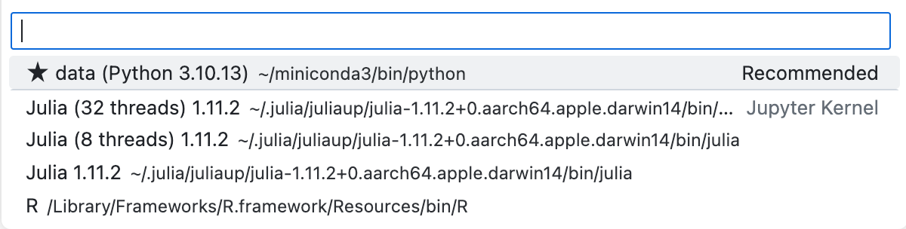

# Chapter 1. Installation and Basics


## How to install Julia

For fresh installation on linux / mac ([if you are using windows, click here](https://julialang.org/downloads/)):

`curl -fsSL <https://install.julialang.org> | sh`


If you have previous versions installed:

`juliaup self uninstall`

## Jupyter Notebook Kernels
1. Run `julia` in your shell / commandline
2. Install the package for installing a kernel for Jupyter notebooks
   ```Julia
    using Pkg
    Pkg.add("IJulia")
    ```
3. Install a kernel for Jupyter notebook:

    ```Julia
    using IJulia
    installkernel("Julia", "--depwarn=no")
    ```

4. *(optional)* Install additional kernels for multi-threads computing:
   - 8 thraeds

       ```Julia
       using IJulia
       installkernel("Julia (8 threads)", env=Dict("JULIA_NUM_THREADS"=>"8"))
       ```

   - 32 thraeds
       ```Julia
       using IJulia
       installkernel("Julia (32 threads)", env=Dict("JULIA_NUM_THREADS"=>"32"))
       ```
    *(Additional information can be found [here](https://julialang.github.io/IJulia.jl/stable/manual/installation/))*


Now, you will be able to choose Julia for your Jupyter notebooks:



## Basics in Julia

### Print, assign, and operatons

Different from that in Python and R, Julia uses function `println()` to print strings and logs:


```julia
println("Hello")
```

    Hello


Some times, we want to create new variables, and assign values to them -- it's like Python:


```julia
text = "Hello"
println(text)
```

    Hello


Of course, we want to combine some logs for us to document the progress of analysis:


```julia
text = "Hello"
text_to_print = string(text, ", world!")
println(text_to_print)
```

    Hello, world!


Alternatively, you can also use `*` operater to concat strings:


```julia
text = "Hello"
text_to_print = text * ", world!"
println(text_to_print)
```

    Hello, world!


*(This seemingly weird operation is [explained here](https://docs.julialang.org/en/v1/manual/strings/#man-concatenation))*

You may have noted that we are doing operations. In Julia, basic operations of numbers are:

1. Arithmetic Operators

    | Expression | Name             | Description                                |
    |------------|------------------|--------------------------------------------|
    | x + y      | binary plus      | performs addition                          |
    | x - y      | binary minus     | performs subtraction                       |
    | x * y      | times            | performs multiplication                    |
    | x / y      | divide           | performs division                          |
    | x ÷ y      | integer divide   | x / y, truncated to an integer             |
    | x ^ y      | power            | raises x to the yth power                  |
    | x % y      | remainder        | equivalent to rem(x, y)                    |

    *(Those are common operations, see [full list here](https://docs.julialang.org/en/v1/manual/mathematical-operations/#Arithmetic-Operators))*


2. Logical Operators

    | Expression | Name                   |
    |------------|------------------------|
    | !x         | Not               |
    | x && y     | And   |
    | x \|\| y     | Or    |


3. Comparisons

    | Operator | Name                         |
    |----------|------------------------------|
    | ==       | Equal to                     |
    | !=, ≠    | Not equal to                  |
    | <        | Less than                    |
    | <=, ≤    | Less than or equal to        |
    | >        | Greater than                 |
    | >=, ≥    | Greater than or equal to     |


There are more operations less frequently used in data analysis, see [full list here](https://docs.julialang.org/en/v1/manual/mathematical-operations/#Arithmetic-Operators).


### Data structures

Some operations are only applicable to certain data types (e.g., the `*` function for concatanating strings has a different meaning to numerical values). If you are confused about the data type of a variable:

**String**


```julia
typeof(text)
```


    String


**Interger**

To save memories, you can define the length of a number:


```julia
number_a::Int8 = 60;
println(typeof(number_a))

number_b::Int128 = 60;
println(typeof(number_b))
```

    Int8
    Int128
    Int128


By default, it's 64:


```julia
number_c = 60;
println(typeof(number_c))
```

    Int64


**Float**


```julia
number_d = 1.27

println(typeof(number_d))
```

    Float64


What would happen if an `int` is multiplied by a `float`?


```julia
println(typeof(number_a * number_d))
```

    Float64


Julia also has a dynamic type system.

**Vector (List / Array)**


```julia
list_a = ["a", "b", "c"]

println(typeof(list_a))
```

    Vector{String}


A vector can be indexed by an integer:


```julia
list_a[1]
```


    "a"


Or a vector:


```julia
list_a[[1, 2]]
```


    2-element Vector{String}:
     "a"
     "b"


**Tuples**


```julia
brands = ("Apple", "Samsung", "Google")

println(typeof(brands))
```

    Tuple{String, String, String}


A tuple can be indexed by an integer:


```julia
brands[1]
```


    "Apple"


Or a vector:


```julia
brands[[1, 2]]
```


    ("Apple", "Samsung")


To quickly create a vector composing of a continuous integers for indexing:


```julia
brands[1:3]
```


    ("Apple", "Samsung", "Google")


Because `1:3` has created a vector-like range:


```julia
println(typeof(1:3))
```

    UnitRange{Int64}


**Dictionary**


```julia
scores_a = Dict(
  "John" => 98,
  "Jessy" => 99
)

println(typeof(scores_a))
```

    Dict{String, Int64}


The dictionary can be retrieved by its key:


```julia
scores_a["John"]
```


    98


And the value can be changed:


```julia
scores_a["John"] = 30
scores_a
```


    Dict{String, Int64} with 2 entries:
      "John"  => 30
      "Jessy" => 99


## Using Packages

In many cases, we need to import many packages to finish diverse tasks. For example, we use `ggplot2` in R to create beautiful figures.

In Julia, the workflow is like what we have in R (you can also use [my package to simplify the same process in Python](https://github.com/reycn/pkgman)).


```julia
using Pkg; Pkg.add("JSON")
```

       Resolving package versions...
        Updating `~/.julia/environments/v1.11/Project.toml`
      [682c06a0] + JSON v0.21.4
      No Changes to `~/.julia/environments/v1.11/Manifest.toml`


Then, when a package is installed, you need to claim to use it before using:


```julia
using JSON
```

After that, you are able to use methods of a package such as `JSON.parsefile("some.json")` here

## Functions and methods

To define a function:


```julia
function greet(name) 
  "Hello, $name."
end;
```


```julia
greet("Jessy")
```


    "Hello, Jessy."


To use a method defined globally, such as `println`, just call it.

If it's from a package, use `package.method`, e.g., `JSON.parsefile("some.json")` we've mentioned.


Great! Let's move on to [load your data](./1.data.loading.selection.jl.ipynb) first.

