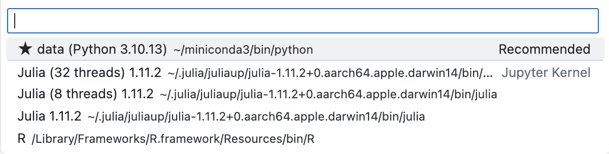

# Installation and Basics

## How to install Julia

For fresh installation on linux / mac ([if you are using windows, click here](https://julialang.org/downloads/)):

`curl -fsSL <https://install.julialang.org> | sh`


If you have previous versions installed:

`juliaup self uninstall`

## Jupyter Notebook Kernels
1. Run `julia` in your shell / commandline
2. Install the package for installing a kernel for Jupyter notebooks
   ```Julia
    using Pkg
    Pkg.add("IJulia")
    ```
3. Install a kernel for Jupyter notebook:

    ```Julia
    using IJulia
    installkernel("Julia", "--depwarn=no")
    ```

4. *(optional)* Install additional kernels for multi-threads computing:
   - 8 thraeds

       ```Julia
       using IJulia
       installkernel("Julia (8 threads)", env=Dict("JULIA_NUM_THREADS"=>"8"))
       ```

   - 32 thraeds
       ```Julia
       using IJulia
       installkernel("Julia (32 threads)", env=Dict("JULIA_NUM_THREADS"=>"32"))
       ```
    *(Additional information can be found [here](https://julialang.github.io/IJulia.jl/stable/manual/installation/))*


Now, you will be able to choose Julia for your Jupyter notebooks:



Great! Let's move on to [load your data](./1.data.loading.selection.jl.ipynb) first.
