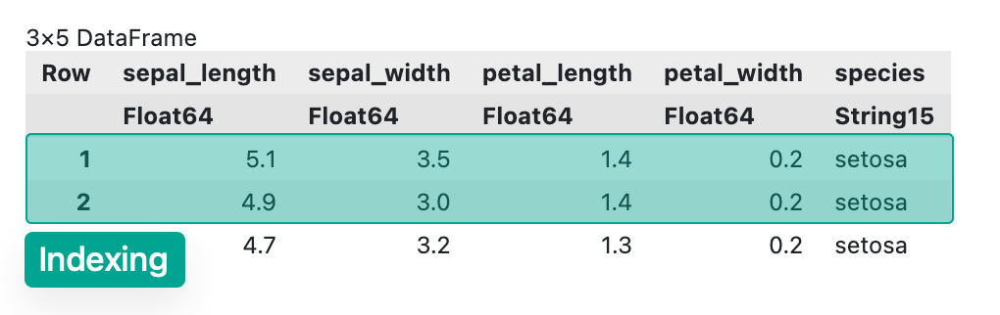
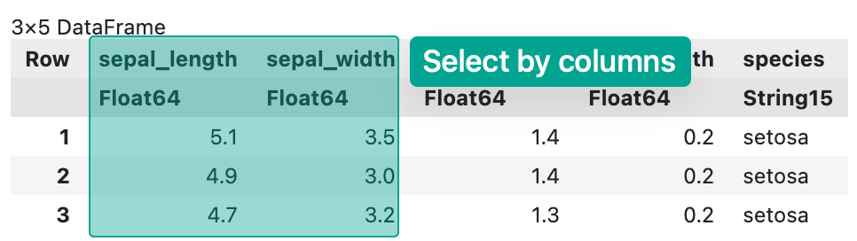
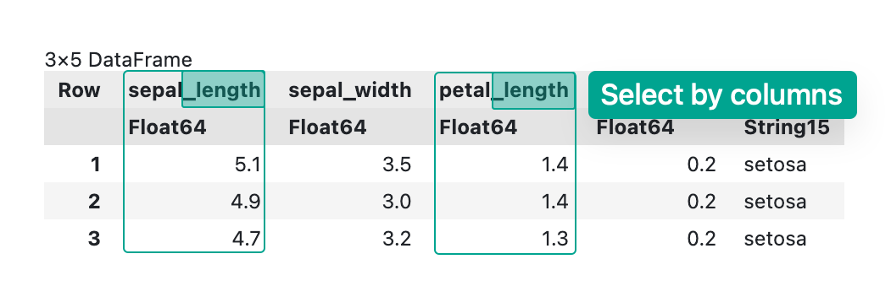
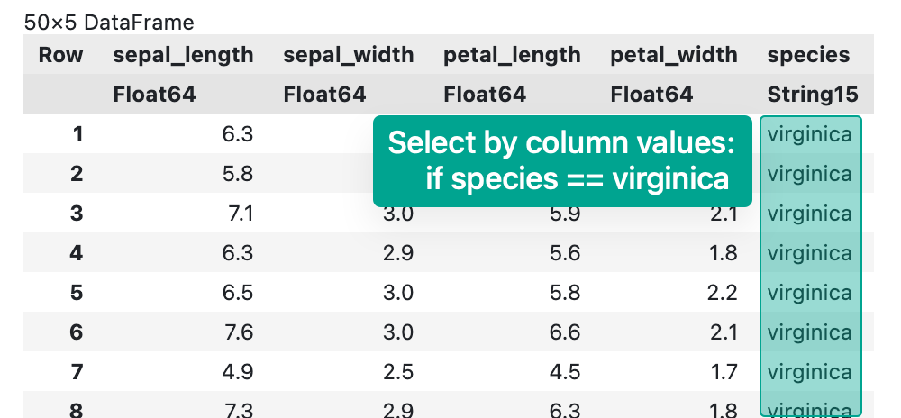

# Chapter 2. Loading Data in Julia

### 1. Load common datasets

Firstly, we need to load some sample data, so we can install a common package for convenience:


```julia
using Pkg
Pkg.add("RDatasets")
```

       Resolving package versions...
      No Changes to `~/.julia/environments/v1.11/Project.toml`
      No Changes to `~/.julia/environments/v1.11/Manifest.toml`


```julia
using RDatasets
df = dataset("datasets", "iris")
first(df, 5)
```


<div><div style = "float: left;"><span>5×5 DataFrame</span></div><div style = "clear: both;"></div></div><div class = "data-frame" style = "overflow-x: scroll;"><table class = "data-frame" style = "margin-bottom: 6px;"><thead><tr class = "header"><th class = "rowNumber" style = "font-weight: bold; text-align: right;">Row</th><th style = "text-align: left;">SepalLength</th><th style = "text-align: left;">SepalWidth</th><th style = "text-align: left;">PetalLength</th><th style = "text-align: left;">PetalWidth</th><th style = "text-align: left;">Species</th></tr><tr class = "subheader headerLastRow"><th class = "rowNumber" style = "font-weight: bold; text-align: right;"></th><th title = "Float64" style = "text-align: left;">Float64</th><th title = "Float64" style = "text-align: left;">Float64</th><th title = "Float64" style = "text-align: left;">Float64</th><th title = "Float64" style = "text-align: left;">Float64</th><th title = "CategoricalArrays.CategoricalValue{String, UInt8}" style = "text-align: left;">Cat…</th></tr></thead><tbody><tr><td class = "rowNumber" style = "font-weight: bold; text-align: right;">1</td><td style = "text-align: right;">5.1</td><td style = "text-align: right;">3.5</td><td style = "text-align: right;">1.4</td><td style = "text-align: right;">0.2</td><td style = "text-align: left;">setosa</td></tr><tr><td class = "rowNumber" style = "font-weight: bold; text-align: right;">2</td><td style = "text-align: right;">4.9</td><td style = "text-align: right;">3.0</td><td style = "text-align: right;">1.4</td><td style = "text-align: right;">0.2</td><td style = "text-align: left;">setosa</td></tr><tr><td class = "rowNumber" style = "font-weight: bold; text-align: right;">3</td><td style = "text-align: right;">4.7</td><td style = "text-align: right;">3.2</td><td style = "text-align: right;">1.3</td><td style = "text-align: right;">0.2</td><td style = "text-align: left;">setosa</td></tr><tr><td class = "rowNumber" style = "font-weight: bold; text-align: right;">4</td><td style = "text-align: right;">4.6</td><td style = "text-align: right;">3.1</td><td style = "text-align: right;">1.5</td><td style = "text-align: right;">0.2</td><td style = "text-align: left;">setosa</td></tr><tr><td class = "rowNumber" style = "font-weight: bold; text-align: right;">5</td><td style = "text-align: right;">5.0</td><td style = "text-align: right;">3.6</td><td style = "text-align: right;">1.4</td><td style = "text-align: right;">0.2</td><td style = "text-align: left;">setosa</td></tr></tbody></table></div>


Here, we are using `first()` to see the first several rows of the dataframe.

### 2. Load *.csv files locally


```julia
Pkg.add("CSV")
using CSV

df = CSV.read("./res/data/iris.csv", DataFrame)
first(df, 3)
```

       Resolving package versions...
      No Changes to `~/.julia/environments/v1.11/Project.toml`
      No Changes to `~/.julia/environments/v1.11/Manifest.toml`


<div><div style = "float: left;"><span>3×5 DataFrame</span></div><div style = "clear: both;"></div></div><div class = "data-frame" style = "overflow-x: scroll;"><table class = "data-frame" style = "margin-bottom: 6px;"><thead><tr class = "header"><th class = "rowNumber" style = "font-weight: bold; text-align: right;">Row</th><th style = "text-align: left;">sepal_length</th><th style = "text-align: left;">sepal_width</th><th style = "text-align: left;">petal_length</th><th style = "text-align: left;">petal_width</th><th style = "text-align: left;">species</th></tr><tr class = "subheader headerLastRow"><th class = "rowNumber" style = "font-weight: bold; text-align: right;"></th><th title = "Float64" style = "text-align: left;">Float64</th><th title = "Float64" style = "text-align: left;">Float64</th><th title = "Float64" style = "text-align: left;">Float64</th><th title = "Float64" style = "text-align: left;">Float64</th><th title = "String15" style = "text-align: left;">String15</th></tr></thead><tbody><tr><td class = "rowNumber" style = "font-weight: bold; text-align: right;">1</td><td style = "text-align: right;">5.1</td><td style = "text-align: right;">3.5</td><td style = "text-align: right;">1.4</td><td style = "text-align: right;">0.2</td><td style = "text-align: left;">setosa</td></tr><tr><td class = "rowNumber" style = "font-weight: bold; text-align: right;">2</td><td style = "text-align: right;">4.9</td><td style = "text-align: right;">3.0</td><td style = "text-align: right;">1.4</td><td style = "text-align: right;">0.2</td><td style = "text-align: left;">setosa</td></tr><tr><td class = "rowNumber" style = "font-weight: bold; text-align: right;">3</td><td style = "text-align: right;">4.7</td><td style = "text-align: right;">3.2</td><td style = "text-align: right;">1.3</td><td style = "text-align: right;">0.2</td><td style = "text-align: left;">setosa</td></tr></tbody></table></div>


### 3. Load datasets online


```julia
Pkg.add("HTTP")
using HTTP

url = "https://github.com/mwaskom/seaborn-data/raw/master/iris.csv"
response = HTTP.get(url)
df = CSV.read(IOBuffer(response.body), DataFrame)
first(df, 3)
```

       Resolving package versions...
      No Changes to `~/.julia/environments/v1.11/Project.toml`
      No Changes to `~/.julia/environments/v1.11/Manifest.toml`


<div><div style = "float: left;"><span>3×5 DataFrame</span></div><div style = "clear: both;"></div></div><div class = "data-frame" style = "overflow-x: scroll;"><table class = "data-frame" style = "margin-bottom: 6px;"><thead><tr class = "header"><th class = "rowNumber" style = "font-weight: bold; text-align: right;">Row</th><th style = "text-align: left;">sepal_length</th><th style = "text-align: left;">sepal_width</th><th style = "text-align: left;">petal_length</th><th style = "text-align: left;">petal_width</th><th style = "text-align: left;">species</th></tr><tr class = "subheader headerLastRow"><th class = "rowNumber" style = "font-weight: bold; text-align: right;"></th><th title = "Float64" style = "text-align: left;">Float64</th><th title = "Float64" style = "text-align: left;">Float64</th><th title = "Float64" style = "text-align: left;">Float64</th><th title = "Float64" style = "text-align: left;">Float64</th><th title = "String15" style = "text-align: left;">String15</th></tr></thead><tbody><tr><td class = "rowNumber" style = "font-weight: bold; text-align: right;">1</td><td style = "text-align: right;">5.1</td><td style = "text-align: right;">3.5</td><td style = "text-align: right;">1.4</td><td style = "text-align: right;">0.2</td><td style = "text-align: left;">setosa</td></tr><tr><td class = "rowNumber" style = "font-weight: bold; text-align: right;">2</td><td style = "text-align: right;">4.9</td><td style = "text-align: right;">3.0</td><td style = "text-align: right;">1.4</td><td style = "text-align: right;">0.2</td><td style = "text-align: left;">setosa</td></tr><tr><td class = "rowNumber" style = "font-weight: bold; text-align: right;">3</td><td style = "text-align: right;">4.7</td><td style = "text-align: right;">3.2</td><td style = "text-align: right;">1.3</td><td style = "text-align: right;">0.2</td><td style = "text-align: left;">setosa</td></tr></tbody></table></div>


### 4. Creating a data frame from scratch:


```julia
Pkg.add("DataFrames")
using DataFrames

df2 = DataFrame(
  title = ["A", "B", "C"],
  published = [1, 2, 3], 
  author = "Rongxin"
)
first(df2, 3)
```

       Resolving package versions...
      No Changes to `~/.julia/environments/v1.11/Project.toml`
      No Changes to `~/.julia/environments/v1.11/Manifest.toml`


<div><div style = "float: left;"><span>3×3 DataFrame</span></div><div style = "clear: both;"></div></div><div class = "data-frame" style = "overflow-x: scroll;"><table class = "data-frame" style = "margin-bottom: 6px;"><thead><tr class = "header"><th class = "rowNumber" style = "font-weight: bold; text-align: right;">Row</th><th style = "text-align: left;">title</th><th style = "text-align: left;">published</th><th style = "text-align: left;">author</th></tr><tr class = "subheader headerLastRow"><th class = "rowNumber" style = "font-weight: bold; text-align: right;"></th><th title = "String" style = "text-align: left;">String</th><th title = "Int64" style = "text-align: left;">Int64</th><th title = "String" style = "text-align: left;">String</th></tr></thead><tbody><tr><td class = "rowNumber" style = "font-weight: bold; text-align: right;">1</td><td style = "text-align: left;">A</td><td style = "text-align: right;">1</td><td style = "text-align: left;">Rongxin</td></tr><tr><td class = "rowNumber" style = "font-weight: bold; text-align: right;">2</td><td style = "text-align: left;">B</td><td style = "text-align: right;">2</td><td style = "text-align: left;">Rongxin</td></tr><tr><td class = "rowNumber" style = "font-weight: bold; text-align: right;">3</td><td style = "text-align: left;">C</td><td style = "text-align: right;">3</td><td style = "text-align: left;">Rongxin</td></tr></tbody></table></div>


## Selecting Data in Julia

### 1. Indexing a subset



We can select a subset using a pair of row-column indexes. For example, if we want to select the first row to the second row, with all columns, we can:


```julia
df[1:2, :]
```


<div><div style = "float: left;"><span>2×5 DataFrame</span></div><div style = "clear: both;"></div></div><div class = "data-frame" style = "overflow-x: scroll;"><table class = "data-frame" style = "margin-bottom: 6px;"><thead><tr class = "header"><th class = "rowNumber" style = "font-weight: bold; text-align: right;">Row</th><th style = "text-align: left;">sepal_length</th><th style = "text-align: left;">sepal_width</th><th style = "text-align: left;">petal_length</th><th style = "text-align: left;">petal_width</th><th style = "text-align: left;">species</th></tr><tr class = "subheader headerLastRow"><th class = "rowNumber" style = "font-weight: bold; text-align: right;"></th><th title = "Float64" style = "text-align: left;">Float64</th><th title = "Float64" style = "text-align: left;">Float64</th><th title = "Float64" style = "text-align: left;">Float64</th><th title = "Float64" style = "text-align: left;">Float64</th><th title = "String15" style = "text-align: left;">String15</th></tr></thead><tbody><tr><td class = "rowNumber" style = "font-weight: bold; text-align: right;">1</td><td style = "text-align: right;">5.1</td><td style = "text-align: right;">3.5</td><td style = "text-align: right;">1.4</td><td style = "text-align: right;">0.2</td><td style = "text-align: left;">setosa</td></tr><tr><td class = "rowNumber" style = "font-weight: bold; text-align: right;">2</td><td style = "text-align: right;">4.9</td><td style = "text-align: right;">3.0</td><td style = "text-align: right;">1.4</td><td style = "text-align: right;">0.2</td><td style = "text-align: left;">setosa</td></tr></tbody></table></div>


### 2. Select by column names




```julia
df[:, [:sepal_width, :petal_length]]
```


<div><div style = "float: left;"><span>150×2 DataFrame</span></div><div style = "float: right;"><span style = "font-style: italic;">125 rows omitted</span></div><div style = "clear: both;"></div></div><div class = "data-frame" style = "overflow-x: scroll;"><table class = "data-frame" style = "margin-bottom: 6px;"><thead><tr class = "header"><th class = "rowNumber" style = "font-weight: bold; text-align: right;">Row</th><th style = "text-align: left;">sepal_width</th><th style = "text-align: left;">petal_length</th></tr><tr class = "subheader headerLastRow"><th class = "rowNumber" style = "font-weight: bold; text-align: right;"></th><th title = "Float64" style = "text-align: left;">Float64</th><th title = "Float64" style = "text-align: left;">Float64</th></tr></thead><tbody><tr><td class = "rowNumber" style = "font-weight: bold; text-align: right;">1</td><td style = "text-align: right;">3.5</td><td style = "text-align: right;">1.4</td></tr><tr><td class = "rowNumber" style = "font-weight: bold; text-align: right;">2</td><td style = "text-align: right;">3.0</td><td style = "text-align: right;">1.4</td></tr><tr><td class = "rowNumber" style = "font-weight: bold; text-align: right;">3</td><td style = "text-align: right;">3.2</td><td style = "text-align: right;">1.3</td></tr><tr><td class = "rowNumber" style = "font-weight: bold; text-align: right;">4</td><td style = "text-align: right;">3.1</td><td style = "text-align: right;">1.5</td></tr><tr><td class = "rowNumber" style = "font-weight: bold; text-align: right;">5</td><td style = "text-align: right;">3.6</td><td style = "text-align: right;">1.4</td></tr><tr><td class = "rowNumber" style = "font-weight: bold; text-align: right;">6</td><td style = "text-align: right;">3.9</td><td style = "text-align: right;">1.7</td></tr><tr><td class = "rowNumber" style = "font-weight: bold; text-align: right;">7</td><td style = "text-align: right;">3.4</td><td style = "text-align: right;">1.4</td></tr><tr><td class = "rowNumber" style = "font-weight: bold; text-align: right;">8</td><td style = "text-align: right;">3.4</td><td style = "text-align: right;">1.5</td></tr><tr><td class = "rowNumber" style = "font-weight: bold; text-align: right;">9</td><td style = "text-align: right;">2.9</td><td style = "text-align: right;">1.4</td></tr><tr><td class = "rowNumber" style = "font-weight: bold; text-align: right;">10</td><td style = "text-align: right;">3.1</td><td style = "text-align: right;">1.5</td></tr><tr><td class = "rowNumber" style = "font-weight: bold; text-align: right;">11</td><td style = "text-align: right;">3.7</td><td style = "text-align: right;">1.5</td></tr><tr><td class = "rowNumber" style = "font-weight: bold; text-align: right;">12</td><td style = "text-align: right;">3.4</td><td style = "text-align: right;">1.6</td></tr><tr><td class = "rowNumber" style = "font-weight: bold; text-align: right;">13</td><td style = "text-align: right;">3.0</td><td style = "text-align: right;">1.4</td></tr><tr><td style = "text-align: right;">&vellip;</td><td style = "text-align: right;">&vellip;</td><td style = "text-align: right;">&vellip;</td></tr><tr><td class = "rowNumber" style = "font-weight: bold; text-align: right;">139</td><td style = "text-align: right;">3.0</td><td style = "text-align: right;">4.8</td></tr><tr><td class = "rowNumber" style = "font-weight: bold; text-align: right;">140</td><td style = "text-align: right;">3.1</td><td style = "text-align: right;">5.4</td></tr><tr><td class = "rowNumber" style = "font-weight: bold; text-align: right;">141</td><td style = "text-align: right;">3.1</td><td style = "text-align: right;">5.6</td></tr><tr><td class = "rowNumber" style = "font-weight: bold; text-align: right;">142</td><td style = "text-align: right;">3.1</td><td style = "text-align: right;">5.1</td></tr><tr><td class = "rowNumber" style = "font-weight: bold; text-align: right;">143</td><td style = "text-align: right;">2.7</td><td style = "text-align: right;">5.1</td></tr><tr><td class = "rowNumber" style = "font-weight: bold; text-align: right;">144</td><td style = "text-align: right;">3.2</td><td style = "text-align: right;">5.9</td></tr><tr><td class = "rowNumber" style = "font-weight: bold; text-align: right;">145</td><td style = "text-align: right;">3.3</td><td style = "text-align: right;">5.7</td></tr><tr><td class = "rowNumber" style = "font-weight: bold; text-align: right;">146</td><td style = "text-align: right;">3.0</td><td style = "text-align: right;">5.2</td></tr><tr><td class = "rowNumber" style = "font-weight: bold; text-align: right;">147</td><td style = "text-align: right;">2.5</td><td style = "text-align: right;">5.0</td></tr><tr><td class = "rowNumber" style = "font-weight: bold; text-align: right;">148</td><td style = "text-align: right;">3.0</td><td style = "text-align: right;">5.2</td></tr><tr><td class = "rowNumber" style = "font-weight: bold; text-align: right;">149</td><td style = "text-align: right;">3.4</td><td style = "text-align: right;">5.4</td></tr><tr><td class = "rowNumber" style = "font-weight: bold; text-align: right;">150</td><td style = "text-align: right;">3.0</td><td style = "text-align: right;">5.1</td></tr></tbody></table></div>


And the powerful part of it is, we can directly using regex to select columns!

For instance, if we only care about the columns ended with `length`, we can:




```julia
df[:, r".*length$"]
```


<div><div style = "float: left;"><span>150×2 DataFrame</span></div><div style = "float: right;"><span style = "font-style: italic;">125 rows omitted</span></div><div style = "clear: both;"></div></div><div class = "data-frame" style = "overflow-x: scroll;"><table class = "data-frame" style = "margin-bottom: 6px;"><thead><tr class = "header"><th class = "rowNumber" style = "font-weight: bold; text-align: right;">Row</th><th style = "text-align: left;">sepal_length</th><th style = "text-align: left;">petal_length</th></tr><tr class = "subheader headerLastRow"><th class = "rowNumber" style = "font-weight: bold; text-align: right;"></th><th title = "Float64" style = "text-align: left;">Float64</th><th title = "Float64" style = "text-align: left;">Float64</th></tr></thead><tbody><tr><td class = "rowNumber" style = "font-weight: bold; text-align: right;">1</td><td style = "text-align: right;">5.1</td><td style = "text-align: right;">1.4</td></tr><tr><td class = "rowNumber" style = "font-weight: bold; text-align: right;">2</td><td style = "text-align: right;">4.9</td><td style = "text-align: right;">1.4</td></tr><tr><td class = "rowNumber" style = "font-weight: bold; text-align: right;">3</td><td style = "text-align: right;">4.7</td><td style = "text-align: right;">1.3</td></tr><tr><td class = "rowNumber" style = "font-weight: bold; text-align: right;">4</td><td style = "text-align: right;">4.6</td><td style = "text-align: right;">1.5</td></tr><tr><td class = "rowNumber" style = "font-weight: bold; text-align: right;">5</td><td style = "text-align: right;">5.0</td><td style = "text-align: right;">1.4</td></tr><tr><td class = "rowNumber" style = "font-weight: bold; text-align: right;">6</td><td style = "text-align: right;">5.4</td><td style = "text-align: right;">1.7</td></tr><tr><td class = "rowNumber" style = "font-weight: bold; text-align: right;">7</td><td style = "text-align: right;">4.6</td><td style = "text-align: right;">1.4</td></tr><tr><td class = "rowNumber" style = "font-weight: bold; text-align: right;">8</td><td style = "text-align: right;">5.0</td><td style = "text-align: right;">1.5</td></tr><tr><td class = "rowNumber" style = "font-weight: bold; text-align: right;">9</td><td style = "text-align: right;">4.4</td><td style = "text-align: right;">1.4</td></tr><tr><td class = "rowNumber" style = "font-weight: bold; text-align: right;">10</td><td style = "text-align: right;">4.9</td><td style = "text-align: right;">1.5</td></tr><tr><td class = "rowNumber" style = "font-weight: bold; text-align: right;">11</td><td style = "text-align: right;">5.4</td><td style = "text-align: right;">1.5</td></tr><tr><td class = "rowNumber" style = "font-weight: bold; text-align: right;">12</td><td style = "text-align: right;">4.8</td><td style = "text-align: right;">1.6</td></tr><tr><td class = "rowNumber" style = "font-weight: bold; text-align: right;">13</td><td style = "text-align: right;">4.8</td><td style = "text-align: right;">1.4</td></tr><tr><td style = "text-align: right;">&vellip;</td><td style = "text-align: right;">&vellip;</td><td style = "text-align: right;">&vellip;</td></tr><tr><td class = "rowNumber" style = "font-weight: bold; text-align: right;">139</td><td style = "text-align: right;">6.0</td><td style = "text-align: right;">4.8</td></tr><tr><td class = "rowNumber" style = "font-weight: bold; text-align: right;">140</td><td style = "text-align: right;">6.9</td><td style = "text-align: right;">5.4</td></tr><tr><td class = "rowNumber" style = "font-weight: bold; text-align: right;">141</td><td style = "text-align: right;">6.7</td><td style = "text-align: right;">5.6</td></tr><tr><td class = "rowNumber" style = "font-weight: bold; text-align: right;">142</td><td style = "text-align: right;">6.9</td><td style = "text-align: right;">5.1</td></tr><tr><td class = "rowNumber" style = "font-weight: bold; text-align: right;">143</td><td style = "text-align: right;">5.8</td><td style = "text-align: right;">5.1</td></tr><tr><td class = "rowNumber" style = "font-weight: bold; text-align: right;">144</td><td style = "text-align: right;">6.8</td><td style = "text-align: right;">5.9</td></tr><tr><td class = "rowNumber" style = "font-weight: bold; text-align: right;">145</td><td style = "text-align: right;">6.7</td><td style = "text-align: right;">5.7</td></tr><tr><td class = "rowNumber" style = "font-weight: bold; text-align: right;">146</td><td style = "text-align: right;">6.7</td><td style = "text-align: right;">5.2</td></tr><tr><td class = "rowNumber" style = "font-weight: bold; text-align: right;">147</td><td style = "text-align: right;">6.3</td><td style = "text-align: right;">5.0</td></tr><tr><td class = "rowNumber" style = "font-weight: bold; text-align: right;">148</td><td style = "text-align: right;">6.5</td><td style = "text-align: right;">5.2</td></tr><tr><td class = "rowNumber" style = "font-weight: bold; text-align: right;">149</td><td style = "text-align: right;">6.2</td><td style = "text-align: right;">5.4</td></tr><tr><td class = "rowNumber" style = "font-weight: bold; text-align: right;">150</td><td style = "text-align: right;">5.9</td><td style = "text-align: right;">5.1</td></tr></tbody></table></div>


### 3. Conditional filtering

It's common in data analysis that we want to subset a dataframe according to a condition.

In this case, we can define a condition, e.g., find out the rows whose `species` is `virginica`, as the following lines: 




```julia
condition = df.species .== "virginica"
df[condition, :]
```


<div><div style = "float: left;"><span>50×5 DataFrame</span></div><div style = "float: right;"><span style = "font-style: italic;">25 rows omitted</span></div><div style = "clear: both;"></div></div><div class = "data-frame" style = "overflow-x: scroll;"><table class = "data-frame" style = "margin-bottom: 6px;"><thead><tr class = "header"><th class = "rowNumber" style = "font-weight: bold; text-align: right;">Row</th><th style = "text-align: left;">sepal_length</th><th style = "text-align: left;">sepal_width</th><th style = "text-align: left;">petal_length</th><th style = "text-align: left;">petal_width</th><th style = "text-align: left;">species</th></tr><tr class = "subheader headerLastRow"><th class = "rowNumber" style = "font-weight: bold; text-align: right;"></th><th title = "Float64" style = "text-align: left;">Float64</th><th title = "Float64" style = "text-align: left;">Float64</th><th title = "Float64" style = "text-align: left;">Float64</th><th title = "Float64" style = "text-align: left;">Float64</th><th title = "String15" style = "text-align: left;">String15</th></tr></thead><tbody><tr><td class = "rowNumber" style = "font-weight: bold; text-align: right;">1</td><td style = "text-align: right;">6.3</td><td style = "text-align: right;">3.3</td><td style = "text-align: right;">6.0</td><td style = "text-align: right;">2.5</td><td style = "text-align: left;">virginica</td></tr><tr><td class = "rowNumber" style = "font-weight: bold; text-align: right;">2</td><td style = "text-align: right;">5.8</td><td style = "text-align: right;">2.7</td><td style = "text-align: right;">5.1</td><td style = "text-align: right;">1.9</td><td style = "text-align: left;">virginica</td></tr><tr><td class = "rowNumber" style = "font-weight: bold; text-align: right;">3</td><td style = "text-align: right;">7.1</td><td style = "text-align: right;">3.0</td><td style = "text-align: right;">5.9</td><td style = "text-align: right;">2.1</td><td style = "text-align: left;">virginica</td></tr><tr><td class = "rowNumber" style = "font-weight: bold; text-align: right;">4</td><td style = "text-align: right;">6.3</td><td style = "text-align: right;">2.9</td><td style = "text-align: right;">5.6</td><td style = "text-align: right;">1.8</td><td style = "text-align: left;">virginica</td></tr><tr><td class = "rowNumber" style = "font-weight: bold; text-align: right;">5</td><td style = "text-align: right;">6.5</td><td style = "text-align: right;">3.0</td><td style = "text-align: right;">5.8</td><td style = "text-align: right;">2.2</td><td style = "text-align: left;">virginica</td></tr><tr><td class = "rowNumber" style = "font-weight: bold; text-align: right;">6</td><td style = "text-align: right;">7.6</td><td style = "text-align: right;">3.0</td><td style = "text-align: right;">6.6</td><td style = "text-align: right;">2.1</td><td style = "text-align: left;">virginica</td></tr><tr><td class = "rowNumber" style = "font-weight: bold; text-align: right;">7</td><td style = "text-align: right;">4.9</td><td style = "text-align: right;">2.5</td><td style = "text-align: right;">4.5</td><td style = "text-align: right;">1.7</td><td style = "text-align: left;">virginica</td></tr><tr><td class = "rowNumber" style = "font-weight: bold; text-align: right;">8</td><td style = "text-align: right;">7.3</td><td style = "text-align: right;">2.9</td><td style = "text-align: right;">6.3</td><td style = "text-align: right;">1.8</td><td style = "text-align: left;">virginica</td></tr><tr><td class = "rowNumber" style = "font-weight: bold; text-align: right;">9</td><td style = "text-align: right;">6.7</td><td style = "text-align: right;">2.5</td><td style = "text-align: right;">5.8</td><td style = "text-align: right;">1.8</td><td style = "text-align: left;">virginica</td></tr><tr><td class = "rowNumber" style = "font-weight: bold; text-align: right;">10</td><td style = "text-align: right;">7.2</td><td style = "text-align: right;">3.6</td><td style = "text-align: right;">6.1</td><td style = "text-align: right;">2.5</td><td style = "text-align: left;">virginica</td></tr><tr><td class = "rowNumber" style = "font-weight: bold; text-align: right;">11</td><td style = "text-align: right;">6.5</td><td style = "text-align: right;">3.2</td><td style = "text-align: right;">5.1</td><td style = "text-align: right;">2.0</td><td style = "text-align: left;">virginica</td></tr><tr><td class = "rowNumber" style = "font-weight: bold; text-align: right;">12</td><td style = "text-align: right;">6.4</td><td style = "text-align: right;">2.7</td><td style = "text-align: right;">5.3</td><td style = "text-align: right;">1.9</td><td style = "text-align: left;">virginica</td></tr><tr><td class = "rowNumber" style = "font-weight: bold; text-align: right;">13</td><td style = "text-align: right;">6.8</td><td style = "text-align: right;">3.0</td><td style = "text-align: right;">5.5</td><td style = "text-align: right;">2.1</td><td style = "text-align: left;">virginica</td></tr><tr><td style = "text-align: right;">&vellip;</td><td style = "text-align: right;">&vellip;</td><td style = "text-align: right;">&vellip;</td><td style = "text-align: right;">&vellip;</td><td style = "text-align: right;">&vellip;</td><td style = "text-align: right;">&vellip;</td></tr><tr><td class = "rowNumber" style = "font-weight: bold; text-align: right;">39</td><td style = "text-align: right;">6.0</td><td style = "text-align: right;">3.0</td><td style = "text-align: right;">4.8</td><td style = "text-align: right;">1.8</td><td style = "text-align: left;">virginica</td></tr><tr><td class = "rowNumber" style = "font-weight: bold; text-align: right;">40</td><td style = "text-align: right;">6.9</td><td style = "text-align: right;">3.1</td><td style = "text-align: right;">5.4</td><td style = "text-align: right;">2.1</td><td style = "text-align: left;">virginica</td></tr><tr><td class = "rowNumber" style = "font-weight: bold; text-align: right;">41</td><td style = "text-align: right;">6.7</td><td style = "text-align: right;">3.1</td><td style = "text-align: right;">5.6</td><td style = "text-align: right;">2.4</td><td style = "text-align: left;">virginica</td></tr><tr><td class = "rowNumber" style = "font-weight: bold; text-align: right;">42</td><td style = "text-align: right;">6.9</td><td style = "text-align: right;">3.1</td><td style = "text-align: right;">5.1</td><td style = "text-align: right;">2.3</td><td style = "text-align: left;">virginica</td></tr><tr><td class = "rowNumber" style = "font-weight: bold; text-align: right;">43</td><td style = "text-align: right;">5.8</td><td style = "text-align: right;">2.7</td><td style = "text-align: right;">5.1</td><td style = "text-align: right;">1.9</td><td style = "text-align: left;">virginica</td></tr><tr><td class = "rowNumber" style = "font-weight: bold; text-align: right;">44</td><td style = "text-align: right;">6.8</td><td style = "text-align: right;">3.2</td><td style = "text-align: right;">5.9</td><td style = "text-align: right;">2.3</td><td style = "text-align: left;">virginica</td></tr><tr><td class = "rowNumber" style = "font-weight: bold; text-align: right;">45</td><td style = "text-align: right;">6.7</td><td style = "text-align: right;">3.3</td><td style = "text-align: right;">5.7</td><td style = "text-align: right;">2.5</td><td style = "text-align: left;">virginica</td></tr><tr><td class = "rowNumber" style = "font-weight: bold; text-align: right;">46</td><td style = "text-align: right;">6.7</td><td style = "text-align: right;">3.0</td><td style = "text-align: right;">5.2</td><td style = "text-align: right;">2.3</td><td style = "text-align: left;">virginica</td></tr><tr><td class = "rowNumber" style = "font-weight: bold; text-align: right;">47</td><td style = "text-align: right;">6.3</td><td style = "text-align: right;">2.5</td><td style = "text-align: right;">5.0</td><td style = "text-align: right;">1.9</td><td style = "text-align: left;">virginica</td></tr><tr><td class = "rowNumber" style = "font-weight: bold; text-align: right;">48</td><td style = "text-align: right;">6.5</td><td style = "text-align: right;">3.0</td><td style = "text-align: right;">5.2</td><td style = "text-align: right;">2.0</td><td style = "text-align: left;">virginica</td></tr><tr><td class = "rowNumber" style = "font-weight: bold; text-align: right;">49</td><td style = "text-align: right;">6.2</td><td style = "text-align: right;">3.4</td><td style = "text-align: right;">5.4</td><td style = "text-align: right;">2.3</td><td style = "text-align: left;">virginica</td></tr><tr><td class = "rowNumber" style = "font-weight: bold; text-align: right;">50</td><td style = "text-align: right;">5.9</td><td style = "text-align: right;">3.0</td><td style = "text-align: right;">5.1</td><td style = "text-align: right;">1.8</td><td style = "text-align: left;">virginica</td></tr></tbody></table></div>


Now, you know how to load and select dataframes upon your interests, it's time to know how to [transform your data and calculate your variables](https://reynards-org.gitbook.io/data-analysis-in-julia/3.transform.calculate.jl)
