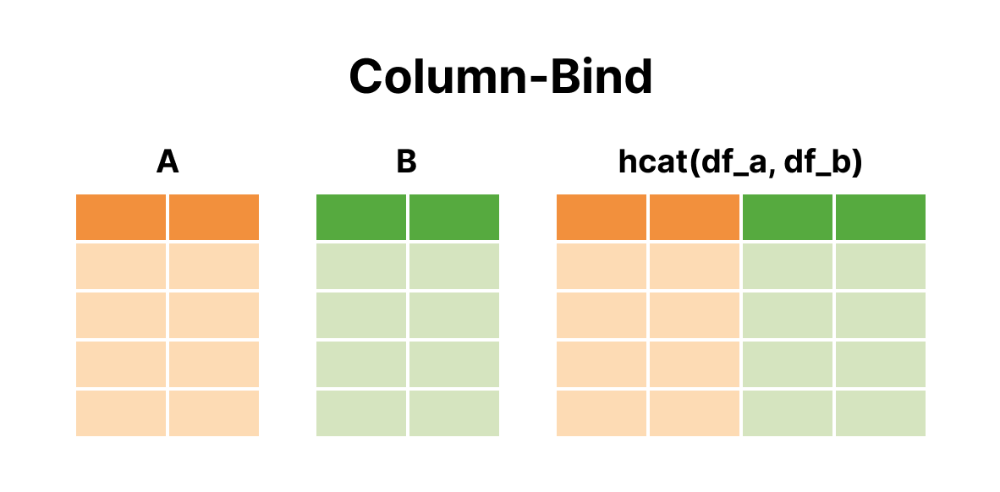

# Chapter 3. Dataframe Transformation


```julia
using CSV, DataFrames, RDatasets, Statistics
```

First, we load the iris data again to illustrate how to manipulate a dataframe in Julia:


```julia
df = dataset("datasets", "iris")
first(df, 5)
```


<div><div style = "float: left;"><span>5×5 DataFrame</span></div><div style = "clear: both;"></div></div><div class = "data-frame" style = "overflow-x: scroll;"><table class = "data-frame" style = "margin-bottom: 6px;"><thead><tr class = "header"><th class = "rowNumber" style = "font-weight: bold; text-align: right;">Row</th><th style = "text-align: left;">SepalLength</th><th style = "text-align: left;">SepalWidth</th><th style = "text-align: left;">PetalLength</th><th style = "text-align: left;">PetalWidth</th><th style = "text-align: left;">Species</th></tr><tr class = "subheader headerLastRow"><th class = "rowNumber" style = "font-weight: bold; text-align: right;"></th><th title = "Float64" style = "text-align: left;">Float64</th><th title = "Float64" style = "text-align: left;">Float64</th><th title = "Float64" style = "text-align: left;">Float64</th><th title = "Float64" style = "text-align: left;">Float64</th><th title = "CategoricalArrays.CategoricalValue{String, UInt8}" style = "text-align: left;">Cat…</th></tr></thead><tbody><tr><td class = "rowNumber" style = "font-weight: bold; text-align: right;">1</td><td style = "text-align: right;">5.1</td><td style = "text-align: right;">3.5</td><td style = "text-align: right;">1.4</td><td style = "text-align: right;">0.2</td><td style = "text-align: left;">setosa</td></tr><tr><td class = "rowNumber" style = "font-weight: bold; text-align: right;">2</td><td style = "text-align: right;">4.9</td><td style = "text-align: right;">3.0</td><td style = "text-align: right;">1.4</td><td style = "text-align: right;">0.2</td><td style = "text-align: left;">setosa</td></tr><tr><td class = "rowNumber" style = "font-weight: bold; text-align: right;">3</td><td style = "text-align: right;">4.7</td><td style = "text-align: right;">3.2</td><td style = "text-align: right;">1.3</td><td style = "text-align: right;">0.2</td><td style = "text-align: left;">setosa</td></tr><tr><td class = "rowNumber" style = "font-weight: bold; text-align: right;">4</td><td style = "text-align: right;">4.6</td><td style = "text-align: right;">3.1</td><td style = "text-align: right;">1.5</td><td style = "text-align: right;">0.2</td><td style = "text-align: left;">setosa</td></tr><tr><td class = "rowNumber" style = "font-weight: bold; text-align: right;">5</td><td style = "text-align: right;">5.0</td><td style = "text-align: right;">3.6</td><td style = "text-align: right;">1.4</td><td style = "text-align: right;">0.2</td><td style = "text-align: left;">setosa</td></tr></tbody></table></div>


## 1. Select a Subset (review)
In the last chapter, we knew how to select a subset. Now, let's do it again.  
In this example, we do not need `SepalWidth` column. For this purpose, we can either use:


```julia
df[:, [:SepalLength, :SepalWidth, :PetalLength, :PetalWidth]]
```


<div><div style = "float: left;"><span>150×4 DataFrame</span></div><div style = "float: right;"><span style = "font-style: italic;">125 rows omitted</span></div><div style = "clear: both;"></div></div><div class = "data-frame" style = "overflow-x: scroll;"><table class = "data-frame" style = "margin-bottom: 6px;"><thead><tr class = "header"><th class = "rowNumber" style = "font-weight: bold; text-align: right;">Row</th><th style = "text-align: left;">SepalLength</th><th style = "text-align: left;">SepalWidth</th><th style = "text-align: left;">PetalLength</th><th style = "text-align: left;">PetalWidth</th></tr><tr class = "subheader headerLastRow"><th class = "rowNumber" style = "font-weight: bold; text-align: right;"></th><th title = "Float64" style = "text-align: left;">Float64</th><th title = "Float64" style = "text-align: left;">Float64</th><th title = "Float64" style = "text-align: left;">Float64</th><th title = "Float64" style = "text-align: left;">Float64</th></tr></thead><tbody><tr><td class = "rowNumber" style = "font-weight: bold; text-align: right;">1</td><td style = "text-align: right;">5.1</td><td style = "text-align: right;">3.5</td><td style = "text-align: right;">1.4</td><td style = "text-align: right;">0.2</td></tr><tr><td class = "rowNumber" style = "font-weight: bold; text-align: right;">2</td><td style = "text-align: right;">4.9</td><td style = "text-align: right;">3.0</td><td style = "text-align: right;">1.4</td><td style = "text-align: right;">0.2</td></tr><tr><td class = "rowNumber" style = "font-weight: bold; text-align: right;">3</td><td style = "text-align: right;">4.7</td><td style = "text-align: right;">3.2</td><td style = "text-align: right;">1.3</td><td style = "text-align: right;">0.2</td></tr><tr><td class = "rowNumber" style = "font-weight: bold; text-align: right;">4</td><td style = "text-align: right;">4.6</td><td style = "text-align: right;">3.1</td><td style = "text-align: right;">1.5</td><td style = "text-align: right;">0.2</td></tr><tr><td class = "rowNumber" style = "font-weight: bold; text-align: right;">5</td><td style = "text-align: right;">5.0</td><td style = "text-align: right;">3.6</td><td style = "text-align: right;">1.4</td><td style = "text-align: right;">0.2</td></tr><tr><td class = "rowNumber" style = "font-weight: bold; text-align: right;">6</td><td style = "text-align: right;">5.4</td><td style = "text-align: right;">3.9</td><td style = "text-align: right;">1.7</td><td style = "text-align: right;">0.4</td></tr><tr><td class = "rowNumber" style = "font-weight: bold; text-align: right;">7</td><td style = "text-align: right;">4.6</td><td style = "text-align: right;">3.4</td><td style = "text-align: right;">1.4</td><td style = "text-align: right;">0.3</td></tr><tr><td class = "rowNumber" style = "font-weight: bold; text-align: right;">8</td><td style = "text-align: right;">5.0</td><td style = "text-align: right;">3.4</td><td style = "text-align: right;">1.5</td><td style = "text-align: right;">0.2</td></tr><tr><td class = "rowNumber" style = "font-weight: bold; text-align: right;">9</td><td style = "text-align: right;">4.4</td><td style = "text-align: right;">2.9</td><td style = "text-align: right;">1.4</td><td style = "text-align: right;">0.2</td></tr><tr><td class = "rowNumber" style = "font-weight: bold; text-align: right;">10</td><td style = "text-align: right;">4.9</td><td style = "text-align: right;">3.1</td><td style = "text-align: right;">1.5</td><td style = "text-align: right;">0.1</td></tr><tr><td class = "rowNumber" style = "font-weight: bold; text-align: right;">11</td><td style = "text-align: right;">5.4</td><td style = "text-align: right;">3.7</td><td style = "text-align: right;">1.5</td><td style = "text-align: right;">0.2</td></tr><tr><td class = "rowNumber" style = "font-weight: bold; text-align: right;">12</td><td style = "text-align: right;">4.8</td><td style = "text-align: right;">3.4</td><td style = "text-align: right;">1.6</td><td style = "text-align: right;">0.2</td></tr><tr><td class = "rowNumber" style = "font-weight: bold; text-align: right;">13</td><td style = "text-align: right;">4.8</td><td style = "text-align: right;">3.0</td><td style = "text-align: right;">1.4</td><td style = "text-align: right;">0.1</td></tr><tr><td style = "text-align: right;">&vellip;</td><td style = "text-align: right;">&vellip;</td><td style = "text-align: right;">&vellip;</td><td style = "text-align: right;">&vellip;</td><td style = "text-align: right;">&vellip;</td></tr><tr><td class = "rowNumber" style = "font-weight: bold; text-align: right;">139</td><td style = "text-align: right;">6.0</td><td style = "text-align: right;">3.0</td><td style = "text-align: right;">4.8</td><td style = "text-align: right;">1.8</td></tr><tr><td class = "rowNumber" style = "font-weight: bold; text-align: right;">140</td><td style = "text-align: right;">6.9</td><td style = "text-align: right;">3.1</td><td style = "text-align: right;">5.4</td><td style = "text-align: right;">2.1</td></tr><tr><td class = "rowNumber" style = "font-weight: bold; text-align: right;">141</td><td style = "text-align: right;">6.7</td><td style = "text-align: right;">3.1</td><td style = "text-align: right;">5.6</td><td style = "text-align: right;">2.4</td></tr><tr><td class = "rowNumber" style = "font-weight: bold; text-align: right;">142</td><td style = "text-align: right;">6.9</td><td style = "text-align: right;">3.1</td><td style = "text-align: right;">5.1</td><td style = "text-align: right;">2.3</td></tr><tr><td class = "rowNumber" style = "font-weight: bold; text-align: right;">143</td><td style = "text-align: right;">5.8</td><td style = "text-align: right;">2.7</td><td style = "text-align: right;">5.1</td><td style = "text-align: right;">1.9</td></tr><tr><td class = "rowNumber" style = "font-weight: bold; text-align: right;">144</td><td style = "text-align: right;">6.8</td><td style = "text-align: right;">3.2</td><td style = "text-align: right;">5.9</td><td style = "text-align: right;">2.3</td></tr><tr><td class = "rowNumber" style = "font-weight: bold; text-align: right;">145</td><td style = "text-align: right;">6.7</td><td style = "text-align: right;">3.3</td><td style = "text-align: right;">5.7</td><td style = "text-align: right;">2.5</td></tr><tr><td class = "rowNumber" style = "font-weight: bold; text-align: right;">146</td><td style = "text-align: right;">6.7</td><td style = "text-align: right;">3.0</td><td style = "text-align: right;">5.2</td><td style = "text-align: right;">2.3</td></tr><tr><td class = "rowNumber" style = "font-weight: bold; text-align: right;">147</td><td style = "text-align: right;">6.3</td><td style = "text-align: right;">2.5</td><td style = "text-align: right;">5.0</td><td style = "text-align: right;">1.9</td></tr><tr><td class = "rowNumber" style = "font-weight: bold; text-align: right;">148</td><td style = "text-align: right;">6.5</td><td style = "text-align: right;">3.0</td><td style = "text-align: right;">5.2</td><td style = "text-align: right;">2.0</td></tr><tr><td class = "rowNumber" style = "font-weight: bold; text-align: right;">149</td><td style = "text-align: right;">6.2</td><td style = "text-align: right;">3.4</td><td style = "text-align: right;">5.4</td><td style = "text-align: right;">2.3</td></tr><tr><td class = "rowNumber" style = "font-weight: bold; text-align: right;">150</td><td style = "text-align: right;">5.9</td><td style = "text-align: right;">3.0</td><td style = "text-align: right;">5.1</td><td style = "text-align: right;">1.8</td></tr></tbody></table></div>


Or a logical calculation based selection:


```julia
df[:, Not(:SepalWidth)]
```


<div><div style = "float: left;"><span>150×4 DataFrame</span></div><div style = "float: right;"><span style = "font-style: italic;">125 rows omitted</span></div><div style = "clear: both;"></div></div><div class = "data-frame" style = "overflow-x: scroll;"><table class = "data-frame" style = "margin-bottom: 6px;"><thead><tr class = "header"><th class = "rowNumber" style = "font-weight: bold; text-align: right;">Row</th><th style = "text-align: left;">SepalLength</th><th style = "text-align: left;">PetalLength</th><th style = "text-align: left;">PetalWidth</th><th style = "text-align: left;">Species</th></tr><tr class = "subheader headerLastRow"><th class = "rowNumber" style = "font-weight: bold; text-align: right;"></th><th title = "Float64" style = "text-align: left;">Float64</th><th title = "Float64" style = "text-align: left;">Float64</th><th title = "Float64" style = "text-align: left;">Float64</th><th title = "CategoricalArrays.CategoricalValue{String, UInt8}" style = "text-align: left;">Cat…</th></tr></thead><tbody><tr><td class = "rowNumber" style = "font-weight: bold; text-align: right;">1</td><td style = "text-align: right;">5.1</td><td style = "text-align: right;">1.4</td><td style = "text-align: right;">0.2</td><td style = "text-align: left;">setosa</td></tr><tr><td class = "rowNumber" style = "font-weight: bold; text-align: right;">2</td><td style = "text-align: right;">4.9</td><td style = "text-align: right;">1.4</td><td style = "text-align: right;">0.2</td><td style = "text-align: left;">setosa</td></tr><tr><td class = "rowNumber" style = "font-weight: bold; text-align: right;">3</td><td style = "text-align: right;">4.7</td><td style = "text-align: right;">1.3</td><td style = "text-align: right;">0.2</td><td style = "text-align: left;">setosa</td></tr><tr><td class = "rowNumber" style = "font-weight: bold; text-align: right;">4</td><td style = "text-align: right;">4.6</td><td style = "text-align: right;">1.5</td><td style = "text-align: right;">0.2</td><td style = "text-align: left;">setosa</td></tr><tr><td class = "rowNumber" style = "font-weight: bold; text-align: right;">5</td><td style = "text-align: right;">5.0</td><td style = "text-align: right;">1.4</td><td style = "text-align: right;">0.2</td><td style = "text-align: left;">setosa</td></tr><tr><td class = "rowNumber" style = "font-weight: bold; text-align: right;">6</td><td style = "text-align: right;">5.4</td><td style = "text-align: right;">1.7</td><td style = "text-align: right;">0.4</td><td style = "text-align: left;">setosa</td></tr><tr><td class = "rowNumber" style = "font-weight: bold; text-align: right;">7</td><td style = "text-align: right;">4.6</td><td style = "text-align: right;">1.4</td><td style = "text-align: right;">0.3</td><td style = "text-align: left;">setosa</td></tr><tr><td class = "rowNumber" style = "font-weight: bold; text-align: right;">8</td><td style = "text-align: right;">5.0</td><td style = "text-align: right;">1.5</td><td style = "text-align: right;">0.2</td><td style = "text-align: left;">setosa</td></tr><tr><td class = "rowNumber" style = "font-weight: bold; text-align: right;">9</td><td style = "text-align: right;">4.4</td><td style = "text-align: right;">1.4</td><td style = "text-align: right;">0.2</td><td style = "text-align: left;">setosa</td></tr><tr><td class = "rowNumber" style = "font-weight: bold; text-align: right;">10</td><td style = "text-align: right;">4.9</td><td style = "text-align: right;">1.5</td><td style = "text-align: right;">0.1</td><td style = "text-align: left;">setosa</td></tr><tr><td class = "rowNumber" style = "font-weight: bold; text-align: right;">11</td><td style = "text-align: right;">5.4</td><td style = "text-align: right;">1.5</td><td style = "text-align: right;">0.2</td><td style = "text-align: left;">setosa</td></tr><tr><td class = "rowNumber" style = "font-weight: bold; text-align: right;">12</td><td style = "text-align: right;">4.8</td><td style = "text-align: right;">1.6</td><td style = "text-align: right;">0.2</td><td style = "text-align: left;">setosa</td></tr><tr><td class = "rowNumber" style = "font-weight: bold; text-align: right;">13</td><td style = "text-align: right;">4.8</td><td style = "text-align: right;">1.4</td><td style = "text-align: right;">0.1</td><td style = "text-align: left;">setosa</td></tr><tr><td style = "text-align: right;">&vellip;</td><td style = "text-align: right;">&vellip;</td><td style = "text-align: right;">&vellip;</td><td style = "text-align: right;">&vellip;</td><td style = "text-align: right;">&vellip;</td></tr><tr><td class = "rowNumber" style = "font-weight: bold; text-align: right;">139</td><td style = "text-align: right;">6.0</td><td style = "text-align: right;">4.8</td><td style = "text-align: right;">1.8</td><td style = "text-align: left;">virginica</td></tr><tr><td class = "rowNumber" style = "font-weight: bold; text-align: right;">140</td><td style = "text-align: right;">6.9</td><td style = "text-align: right;">5.4</td><td style = "text-align: right;">2.1</td><td style = "text-align: left;">virginica</td></tr><tr><td class = "rowNumber" style = "font-weight: bold; text-align: right;">141</td><td style = "text-align: right;">6.7</td><td style = "text-align: right;">5.6</td><td style = "text-align: right;">2.4</td><td style = "text-align: left;">virginica</td></tr><tr><td class = "rowNumber" style = "font-weight: bold; text-align: right;">142</td><td style = "text-align: right;">6.9</td><td style = "text-align: right;">5.1</td><td style = "text-align: right;">2.3</td><td style = "text-align: left;">virginica</td></tr><tr><td class = "rowNumber" style = "font-weight: bold; text-align: right;">143</td><td style = "text-align: right;">5.8</td><td style = "text-align: right;">5.1</td><td style = "text-align: right;">1.9</td><td style = "text-align: left;">virginica</td></tr><tr><td class = "rowNumber" style = "font-weight: bold; text-align: right;">144</td><td style = "text-align: right;">6.8</td><td style = "text-align: right;">5.9</td><td style = "text-align: right;">2.3</td><td style = "text-align: left;">virginica</td></tr><tr><td class = "rowNumber" style = "font-weight: bold; text-align: right;">145</td><td style = "text-align: right;">6.7</td><td style = "text-align: right;">5.7</td><td style = "text-align: right;">2.5</td><td style = "text-align: left;">virginica</td></tr><tr><td class = "rowNumber" style = "font-weight: bold; text-align: right;">146</td><td style = "text-align: right;">6.7</td><td style = "text-align: right;">5.2</td><td style = "text-align: right;">2.3</td><td style = "text-align: left;">virginica</td></tr><tr><td class = "rowNumber" style = "font-weight: bold; text-align: right;">147</td><td style = "text-align: right;">6.3</td><td style = "text-align: right;">5.0</td><td style = "text-align: right;">1.9</td><td style = "text-align: left;">virginica</td></tr><tr><td class = "rowNumber" style = "font-weight: bold; text-align: right;">148</td><td style = "text-align: right;">6.5</td><td style = "text-align: right;">5.2</td><td style = "text-align: right;">2.0</td><td style = "text-align: left;">virginica</td></tr><tr><td class = "rowNumber" style = "font-weight: bold; text-align: right;">149</td><td style = "text-align: right;">6.2</td><td style = "text-align: right;">5.4</td><td style = "text-align: right;">2.3</td><td style = "text-align: left;">virginica</td></tr><tr><td class = "rowNumber" style = "font-weight: bold; text-align: right;">150</td><td style = "text-align: right;">5.9</td><td style = "text-align: right;">5.1</td><td style = "text-align: right;">1.8</td><td style = "text-align: left;">virginica</td></tr></tbody></table></div>


## 2. Split and Combine

### By Row
In R, you can use `rbind()` to combine two dataframes by appending new rows to the origional dataframe. Similarly in Julia, you can:


```julia
df_a = DataFrame(col_a=[1, 2, 3], col_b=[4, 5, 6])
df_b = DataFrame(col_a=[2, 3, 3], col_b=[2, 3, 4])
df_bind = [df_a; df_b]
df_bind
```


<div><div style = "float: left;"><span>6×2 DataFrame</span></div><div style = "clear: both;"></div></div><div class = "data-frame" style = "overflow-x: scroll;"><table class = "data-frame" style = "margin-bottom: 6px;"><thead><tr class = "header"><th class = "rowNumber" style = "font-weight: bold; text-align: right;">Row</th><th style = "text-align: left;">col_a</th><th style = "text-align: left;">col_b</th></tr><tr class = "subheader headerLastRow"><th class = "rowNumber" style = "font-weight: bold; text-align: right;"></th><th title = "Int64" style = "text-align: left;">Int64</th><th title = "Int64" style = "text-align: left;">Int64</th></tr></thead><tbody><tr><td class = "rowNumber" style = "font-weight: bold; text-align: right;">1</td><td style = "text-align: right;">1</td><td style = "text-align: right;">4</td></tr><tr><td class = "rowNumber" style = "font-weight: bold; text-align: right;">2</td><td style = "text-align: right;">2</td><td style = "text-align: right;">5</td></tr><tr><td class = "rowNumber" style = "font-weight: bold; text-align: right;">3</td><td style = "text-align: right;">3</td><td style = "text-align: right;">6</td></tr><tr><td class = "rowNumber" style = "font-weight: bold; text-align: right;">4</td><td style = "text-align: right;">2</td><td style = "text-align: right;">2</td></tr><tr><td class = "rowNumber" style = "font-weight: bold; text-align: right;">5</td><td style = "text-align: right;">3</td><td style = "text-align: right;">3</td></tr><tr><td class = "rowNumber" style = "font-weight: bold; text-align: right;">6</td><td style = "text-align: right;">3</td><td style = "text-align: right;">4</td></tr></tbody></table></div>


Or, because the concatenation is vertical:


```julia
df_bind = vcat(df_a, df_b) # vertical, concat...
df_bind
```


<div><div style = "float: left;"><span>6×2 DataFrame</span></div><div style = "clear: both;"></div></div><div class = "data-frame" style = "overflow-x: scroll;"><table class = "data-frame" style = "margin-bottom: 6px;"><thead><tr class = "header"><th class = "rowNumber" style = "font-weight: bold; text-align: right;">Row</th><th style = "text-align: left;">col_a</th><th style = "text-align: left;">col_b</th></tr><tr class = "subheader headerLastRow"><th class = "rowNumber" style = "font-weight: bold; text-align: right;"></th><th title = "Int64" style = "text-align: left;">Int64</th><th title = "Int64" style = "text-align: left;">Int64</th></tr></thead><tbody><tr><td class = "rowNumber" style = "font-weight: bold; text-align: right;">1</td><td style = "text-align: right;">1</td><td style = "text-align: right;">4</td></tr><tr><td class = "rowNumber" style = "font-weight: bold; text-align: right;">2</td><td style = "text-align: right;">2</td><td style = "text-align: right;">5</td></tr><tr><td class = "rowNumber" style = "font-weight: bold; text-align: right;">3</td><td style = "text-align: right;">3</td><td style = "text-align: right;">6</td></tr><tr><td class = "rowNumber" style = "font-weight: bold; text-align: right;">4</td><td style = "text-align: right;">2</td><td style = "text-align: right;">2</td></tr><tr><td class = "rowNumber" style = "font-weight: bold; text-align: right;">5</td><td style = "text-align: right;">3</td><td style = "text-align: right;">3</td></tr><tr><td class = "rowNumber" style = "font-weight: bold; text-align: right;">6</td><td style = "text-align: right;">3</td><td style = "text-align: right;">4</td></tr></tbody></table></div>


However, if you want to make it faster on large datasets, `append!` is more efficient:


```julia
df_bind = append!(df_a, df_b)
df_bind
```


<div><div style = "float: left;"><span>6×2 DataFrame</span></div><div style = "clear: both;"></div></div><div class = "data-frame" style = "overflow-x: scroll;"><table class = "data-frame" style = "margin-bottom: 6px;"><thead><tr class = "header"><th class = "rowNumber" style = "font-weight: bold; text-align: right;">Row</th><th style = "text-align: left;">col_a</th><th style = "text-align: left;">col_b</th></tr><tr class = "subheader headerLastRow"><th class = "rowNumber" style = "font-weight: bold; text-align: right;"></th><th title = "Int64" style = "text-align: left;">Int64</th><th title = "Int64" style = "text-align: left;">Int64</th></tr></thead><tbody><tr><td class = "rowNumber" style = "font-weight: bold; text-align: right;">1</td><td style = "text-align: right;">1</td><td style = "text-align: right;">4</td></tr><tr><td class = "rowNumber" style = "font-weight: bold; text-align: right;">2</td><td style = "text-align: right;">2</td><td style = "text-align: right;">5</td></tr><tr><td class = "rowNumber" style = "font-weight: bold; text-align: right;">3</td><td style = "text-align: right;">3</td><td style = "text-align: right;">6</td></tr><tr><td class = "rowNumber" style = "font-weight: bold; text-align: right;">4</td><td style = "text-align: right;">2</td><td style = "text-align: right;">2</td></tr><tr><td class = "rowNumber" style = "font-weight: bold; text-align: right;">5</td><td style = "text-align: right;">3</td><td style = "text-align: right;">3</td></tr><tr><td class = "rowNumber" style = "font-weight: bold; text-align: right;">6</td><td style = "text-align: right;">3</td><td style = "text-align: right;">4</td></tr></tbody></table></div>


### By Column



**1. Bind horizontally**  Similar to the vertical concatenation, `vcat()`; we can use `hcat()` for horizontal concatenation:


```julia
df_a = DataFrame(col_a=[1, 2, 3], col_b=[4, 5, 6])
df_b = DataFrame(col_c=[2, 3, 3], col_d=[2, 3, 4])
df_bind = hcat(df_a, df_b) # horizontal, concat...
df_bind
```


<div><div style = "float: left;"><span>3×4 DataFrame</span></div><div style = "clear: both;"></div></div><div class = "data-frame" style = "overflow-x: scroll;"><table class = "data-frame" style = "margin-bottom: 6px;"><thead><tr class = "header"><th class = "rowNumber" style = "font-weight: bold; text-align: right;">Row</th><th style = "text-align: left;">col_a</th><th style = "text-align: left;">col_b</th><th style = "text-align: left;">col_c</th><th style = "text-align: left;">col_d</th></tr><tr class = "subheader headerLastRow"><th class = "rowNumber" style = "font-weight: bold; text-align: right;"></th><th title = "Int64" style = "text-align: left;">Int64</th><th title = "Int64" style = "text-align: left;">Int64</th><th title = "Int64" style = "text-align: left;">Int64</th><th title = "Int64" style = "text-align: left;">Int64</th></tr></thead><tbody><tr><td class = "rowNumber" style = "font-weight: bold; text-align: right;">1</td><td style = "text-align: right;">1</td><td style = "text-align: right;">4</td><td style = "text-align: right;">2</td><td style = "text-align: right;">2</td></tr><tr><td class = "rowNumber" style = "font-weight: bold; text-align: right;">2</td><td style = "text-align: right;">2</td><td style = "text-align: right;">5</td><td style = "text-align: right;">3</td><td style = "text-align: right;">3</td></tr><tr><td class = "rowNumber" style = "font-weight: bold; text-align: right;">3</td><td style = "text-align: right;">3</td><td style = "text-align: right;">6</td><td style = "text-align: right;">3</td><td style = "text-align: right;">4</td></tr></tbody></table></div>


**2. Merge/join horizontally**

While concatenation is convenient, sometime, we have missing values and want to *safely* concat dataframes horizontally by `id` or values of a certain column. In any data pipelinee, there are `join` operations:

(1) Only id(s) existing in both dataframes


```julia
df_a = DataFrame(id=[1, 2, 3], col_a=[4, 5, 6])
df_b = DataFrame(id=[2, 3, 3], col_b=[2, 3, 4])
df_bind = innerjoin(df_a, df_b, on=:id)
df_bind
```


<div><div style = "float: left;"><span>3×3 DataFrame</span></div><div style = "clear: both;"></div></div><div class = "data-frame" style = "overflow-x: scroll;"><table class = "data-frame" style = "margin-bottom: 6px;"><thead><tr class = "header"><th class = "rowNumber" style = "font-weight: bold; text-align: right;">Row</th><th style = "text-align: left;">id</th><th style = "text-align: left;">col_a</th><th style = "text-align: left;">col_b</th></tr><tr class = "subheader headerLastRow"><th class = "rowNumber" style = "font-weight: bold; text-align: right;"></th><th title = "Int64" style = "text-align: left;">Int64</th><th title = "Int64" style = "text-align: left;">Int64</th><th title = "Int64" style = "text-align: left;">Int64</th></tr></thead><tbody><tr><td class = "rowNumber" style = "font-weight: bold; text-align: right;">1</td><td style = "text-align: right;">2</td><td style = "text-align: right;">5</td><td style = "text-align: right;">2</td></tr><tr><td class = "rowNumber" style = "font-weight: bold; text-align: right;">2</td><td style = "text-align: right;">3</td><td style = "text-align: right;">6</td><td style = "text-align: right;">3</td></tr><tr><td class = "rowNumber" style = "font-weight: bold; text-align: right;">3</td><td style = "text-align: right;">3</td><td style = "text-align: right;">6</td><td style = "text-align: right;">4</td></tr></tbody></table></div>


(2) All id(s) existing in either dataframe


```julia
df_bind = outerjoin(df_a, df_b, on=:id)
df_bind
```


<div><div style = "float: left;"><span>4×3 DataFrame</span></div><div style = "clear: both;"></div></div><div class = "data-frame" style = "overflow-x: scroll;"><table class = "data-frame" style = "margin-bottom: 6px;"><thead><tr class = "header"><th class = "rowNumber" style = "font-weight: bold; text-align: right;">Row</th><th style = "text-align: left;">id</th><th style = "text-align: left;">col_a</th><th style = "text-align: left;">col_b</th></tr><tr class = "subheader headerLastRow"><th class = "rowNumber" style = "font-weight: bold; text-align: right;"></th><th title = "Int64" style = "text-align: left;">Int64</th><th title = "Union{Missing, Int64}" style = "text-align: left;">Int64?</th><th title = "Union{Missing, Int64}" style = "text-align: left;">Int64?</th></tr></thead><tbody><tr><td class = "rowNumber" style = "font-weight: bold; text-align: right;">1</td><td style = "text-align: right;">2</td><td style = "text-align: right;">5</td><td style = "text-align: right;">2</td></tr><tr><td class = "rowNumber" style = "font-weight: bold; text-align: right;">2</td><td style = "text-align: right;">3</td><td style = "text-align: right;">6</td><td style = "text-align: right;">3</td></tr><tr><td class = "rowNumber" style = "font-weight: bold; text-align: right;">3</td><td style = "text-align: right;">3</td><td style = "text-align: right;">6</td><td style = "text-align: right;">4</td></tr><tr><td class = "rowNumber" style = "font-weight: bold; text-align: right;">4</td><td style = "text-align: right;">1</td><td style = "text-align: right;">4</td><td style = "font-style: italic; text-align: right;">missing</td></tr></tbody></table></div>


(3) Only id(s) existing in the dataframe on the left


```julia
df_bind = leftjoin(df_a, df_b, on=:id)
df_bind
```


<div><div style = "float: left;"><span>4×3 DataFrame</span></div><div style = "clear: both;"></div></div><div class = "data-frame" style = "overflow-x: scroll;"><table class = "data-frame" style = "margin-bottom: 6px;"><thead><tr class = "header"><th class = "rowNumber" style = "font-weight: bold; text-align: right;">Row</th><th style = "text-align: left;">id</th><th style = "text-align: left;">col_a</th><th style = "text-align: left;">col_b</th></tr><tr class = "subheader headerLastRow"><th class = "rowNumber" style = "font-weight: bold; text-align: right;"></th><th title = "Int64" style = "text-align: left;">Int64</th><th title = "Int64" style = "text-align: left;">Int64</th><th title = "Union{Missing, Int64}" style = "text-align: left;">Int64?</th></tr></thead><tbody><tr><td class = "rowNumber" style = "font-weight: bold; text-align: right;">1</td><td style = "text-align: right;">2</td><td style = "text-align: right;">5</td><td style = "text-align: right;">2</td></tr><tr><td class = "rowNumber" style = "font-weight: bold; text-align: right;">2</td><td style = "text-align: right;">3</td><td style = "text-align: right;">6</td><td style = "text-align: right;">3</td></tr><tr><td class = "rowNumber" style = "font-weight: bold; text-align: right;">3</td><td style = "text-align: right;">3</td><td style = "text-align: right;">6</td><td style = "text-align: right;">4</td></tr><tr><td class = "rowNumber" style = "font-weight: bold; text-align: right;">4</td><td style = "text-align: right;">1</td><td style = "text-align: right;">4</td><td style = "font-style: italic; text-align: right;">missing</td></tr></tbody></table></div>


(4) Only id(s) existing in the dataframe on the right


```julia
df_bind = rightjoin(df_a, df_b, on=:id)
df_bind
```


<div><div style = "float: left;"><span>3×3 DataFrame</span></div><div style = "clear: both;"></div></div><div class = "data-frame" style = "overflow-x: scroll;"><table class = "data-frame" style = "margin-bottom: 6px;"><thead><tr class = "header"><th class = "rowNumber" style = "font-weight: bold; text-align: right;">Row</th><th style = "text-align: left;">id</th><th style = "text-align: left;">col_a</th><th style = "text-align: left;">col_b</th></tr><tr class = "subheader headerLastRow"><th class = "rowNumber" style = "font-weight: bold; text-align: right;"></th><th title = "Int64" style = "text-align: left;">Int64</th><th title = "Union{Missing, Int64}" style = "text-align: left;">Int64?</th><th title = "Int64" style = "text-align: left;">Int64</th></tr></thead><tbody><tr><td class = "rowNumber" style = "font-weight: bold; text-align: right;">1</td><td style = "text-align: right;">2</td><td style = "text-align: right;">5</td><td style = "text-align: right;">2</td></tr><tr><td class = "rowNumber" style = "font-weight: bold; text-align: right;">2</td><td style = "text-align: right;">3</td><td style = "text-align: right;">6</td><td style = "text-align: right;">3</td></tr><tr><td class = "rowNumber" style = "font-weight: bold; text-align: right;">3</td><td style = "text-align: right;">3</td><td style = "text-align: right;">6</td><td style = "text-align: right;">4</td></tr></tbody></table></div>


## 3. Group by

To see the dataset by group, or to prepare for a sub-group calculation, we use


```julia
gdf = groupby(df, :Species)
first(gdf)
```


<div><div style = "float: left;"><span>50×5 SubDataFrame</span></div><div style = "float: right;"><span style = "font-style: italic;">25 rows omitted</span></div><div style = "clear: both;"></div></div><div class = "data-frame" style = "overflow-x: scroll;"><table class = "data-frame" style = "margin-bottom: 6px;"><thead><tr class = "header"><th class = "rowNumber" style = "font-weight: bold; text-align: right;">Row</th><th style = "text-align: left;">SepalLength</th><th style = "text-align: left;">SepalWidth</th><th style = "text-align: left;">PetalLength</th><th style = "text-align: left;">PetalWidth</th><th style = "text-align: left;">Species</th></tr><tr class = "subheader headerLastRow"><th class = "rowNumber" style = "font-weight: bold; text-align: right;"></th><th title = "Float64" style = "text-align: left;">Float64</th><th title = "Float64" style = "text-align: left;">Float64</th><th title = "Float64" style = "text-align: left;">Float64</th><th title = "Float64" style = "text-align: left;">Float64</th><th title = "CategoricalArrays.CategoricalValue{String, UInt8}" style = "text-align: left;">Cat…</th></tr></thead><tbody><tr><td class = "rowNumber" style = "font-weight: bold; text-align: right;">1</td><td style = "text-align: right;">5.1</td><td style = "text-align: right;">3.5</td><td style = "text-align: right;">1.4</td><td style = "text-align: right;">0.2</td><td style = "text-align: left;">setosa</td></tr><tr><td class = "rowNumber" style = "font-weight: bold; text-align: right;">2</td><td style = "text-align: right;">4.9</td><td style = "text-align: right;">3.0</td><td style = "text-align: right;">1.4</td><td style = "text-align: right;">0.2</td><td style = "text-align: left;">setosa</td></tr><tr><td class = "rowNumber" style = "font-weight: bold; text-align: right;">3</td><td style = "text-align: right;">4.7</td><td style = "text-align: right;">3.2</td><td style = "text-align: right;">1.3</td><td style = "text-align: right;">0.2</td><td style = "text-align: left;">setosa</td></tr><tr><td class = "rowNumber" style = "font-weight: bold; text-align: right;">4</td><td style = "text-align: right;">4.6</td><td style = "text-align: right;">3.1</td><td style = "text-align: right;">1.5</td><td style = "text-align: right;">0.2</td><td style = "text-align: left;">setosa</td></tr><tr><td class = "rowNumber" style = "font-weight: bold; text-align: right;">5</td><td style = "text-align: right;">5.0</td><td style = "text-align: right;">3.6</td><td style = "text-align: right;">1.4</td><td style = "text-align: right;">0.2</td><td style = "text-align: left;">setosa</td></tr><tr><td class = "rowNumber" style = "font-weight: bold; text-align: right;">6</td><td style = "text-align: right;">5.4</td><td style = "text-align: right;">3.9</td><td style = "text-align: right;">1.7</td><td style = "text-align: right;">0.4</td><td style = "text-align: left;">setosa</td></tr><tr><td class = "rowNumber" style = "font-weight: bold; text-align: right;">7</td><td style = "text-align: right;">4.6</td><td style = "text-align: right;">3.4</td><td style = "text-align: right;">1.4</td><td style = "text-align: right;">0.3</td><td style = "text-align: left;">setosa</td></tr><tr><td class = "rowNumber" style = "font-weight: bold; text-align: right;">8</td><td style = "text-align: right;">5.0</td><td style = "text-align: right;">3.4</td><td style = "text-align: right;">1.5</td><td style = "text-align: right;">0.2</td><td style = "text-align: left;">setosa</td></tr><tr><td class = "rowNumber" style = "font-weight: bold; text-align: right;">9</td><td style = "text-align: right;">4.4</td><td style = "text-align: right;">2.9</td><td style = "text-align: right;">1.4</td><td style = "text-align: right;">0.2</td><td style = "text-align: left;">setosa</td></tr><tr><td class = "rowNumber" style = "font-weight: bold; text-align: right;">10</td><td style = "text-align: right;">4.9</td><td style = "text-align: right;">3.1</td><td style = "text-align: right;">1.5</td><td style = "text-align: right;">0.1</td><td style = "text-align: left;">setosa</td></tr><tr><td class = "rowNumber" style = "font-weight: bold; text-align: right;">11</td><td style = "text-align: right;">5.4</td><td style = "text-align: right;">3.7</td><td style = "text-align: right;">1.5</td><td style = "text-align: right;">0.2</td><td style = "text-align: left;">setosa</td></tr><tr><td class = "rowNumber" style = "font-weight: bold; text-align: right;">12</td><td style = "text-align: right;">4.8</td><td style = "text-align: right;">3.4</td><td style = "text-align: right;">1.6</td><td style = "text-align: right;">0.2</td><td style = "text-align: left;">setosa</td></tr><tr><td class = "rowNumber" style = "font-weight: bold; text-align: right;">13</td><td style = "text-align: right;">4.8</td><td style = "text-align: right;">3.0</td><td style = "text-align: right;">1.4</td><td style = "text-align: right;">0.1</td><td style = "text-align: left;">setosa</td></tr><tr><td style = "text-align: right;">&vellip;</td><td style = "text-align: right;">&vellip;</td><td style = "text-align: right;">&vellip;</td><td style = "text-align: right;">&vellip;</td><td style = "text-align: right;">&vellip;</td><td style = "text-align: right;">&vellip;</td></tr><tr><td class = "rowNumber" style = "font-weight: bold; text-align: right;">39</td><td style = "text-align: right;">4.4</td><td style = "text-align: right;">3.0</td><td style = "text-align: right;">1.3</td><td style = "text-align: right;">0.2</td><td style = "text-align: left;">setosa</td></tr><tr><td class = "rowNumber" style = "font-weight: bold; text-align: right;">40</td><td style = "text-align: right;">5.1</td><td style = "text-align: right;">3.4</td><td style = "text-align: right;">1.5</td><td style = "text-align: right;">0.2</td><td style = "text-align: left;">setosa</td></tr><tr><td class = "rowNumber" style = "font-weight: bold; text-align: right;">41</td><td style = "text-align: right;">5.0</td><td style = "text-align: right;">3.5</td><td style = "text-align: right;">1.3</td><td style = "text-align: right;">0.3</td><td style = "text-align: left;">setosa</td></tr><tr><td class = "rowNumber" style = "font-weight: bold; text-align: right;">42</td><td style = "text-align: right;">4.5</td><td style = "text-align: right;">2.3</td><td style = "text-align: right;">1.3</td><td style = "text-align: right;">0.3</td><td style = "text-align: left;">setosa</td></tr><tr><td class = "rowNumber" style = "font-weight: bold; text-align: right;">43</td><td style = "text-align: right;">4.4</td><td style = "text-align: right;">3.2</td><td style = "text-align: right;">1.3</td><td style = "text-align: right;">0.2</td><td style = "text-align: left;">setosa</td></tr><tr><td class = "rowNumber" style = "font-weight: bold; text-align: right;">44</td><td style = "text-align: right;">5.0</td><td style = "text-align: right;">3.5</td><td style = "text-align: right;">1.6</td><td style = "text-align: right;">0.6</td><td style = "text-align: left;">setosa</td></tr><tr><td class = "rowNumber" style = "font-weight: bold; text-align: right;">45</td><td style = "text-align: right;">5.1</td><td style = "text-align: right;">3.8</td><td style = "text-align: right;">1.9</td><td style = "text-align: right;">0.4</td><td style = "text-align: left;">setosa</td></tr><tr><td class = "rowNumber" style = "font-weight: bold; text-align: right;">46</td><td style = "text-align: right;">4.8</td><td style = "text-align: right;">3.0</td><td style = "text-align: right;">1.4</td><td style = "text-align: right;">0.3</td><td style = "text-align: left;">setosa</td></tr><tr><td class = "rowNumber" style = "font-weight: bold; text-align: right;">47</td><td style = "text-align: right;">5.1</td><td style = "text-align: right;">3.8</td><td style = "text-align: right;">1.6</td><td style = "text-align: right;">0.2</td><td style = "text-align: left;">setosa</td></tr><tr><td class = "rowNumber" style = "font-weight: bold; text-align: right;">48</td><td style = "text-align: right;">4.6</td><td style = "text-align: right;">3.2</td><td style = "text-align: right;">1.4</td><td style = "text-align: right;">0.2</td><td style = "text-align: left;">setosa</td></tr><tr><td class = "rowNumber" style = "font-weight: bold; text-align: right;">49</td><td style = "text-align: right;">5.3</td><td style = "text-align: right;">3.7</td><td style = "text-align: right;">1.5</td><td style = "text-align: right;">0.2</td><td style = "text-align: left;">setosa</td></tr><tr><td class = "rowNumber" style = "font-weight: bold; text-align: right;">50</td><td style = "text-align: right;">5.0</td><td style = "text-align: right;">3.3</td><td style = "text-align: right;">1.4</td><td style = "text-align: right;">0.2</td><td style = "text-align: left;">setosa</td></tr></tbody></table></div>


Based on this grouped dataframe (`gdf`), we can calculate the mean values of `SepalLength`:


```julia
combine(gdf, :SepalLength => mean)
```


<div><div style = "float: left;"><span>3×2 DataFrame</span></div><div style = "clear: both;"></div></div><div class = "data-frame" style = "overflow-x: scroll;"><table class = "data-frame" style = "margin-bottom: 6px;"><thead><tr class = "header"><th class = "rowNumber" style = "font-weight: bold; text-align: right;">Row</th><th style = "text-align: left;">Species</th><th style = "text-align: left;">SepalLength_mean</th></tr><tr class = "subheader headerLastRow"><th class = "rowNumber" style = "font-weight: bold; text-align: right;"></th><th title = "CategoricalArrays.CategoricalValue{String, UInt8}" style = "text-align: left;">Cat…</th><th title = "Float64" style = "text-align: left;">Float64</th></tr></thead><tbody><tr><td class = "rowNumber" style = "font-weight: bold; text-align: right;">1</td><td style = "text-align: left;">setosa</td><td style = "text-align: right;">5.006</td></tr><tr><td class = "rowNumber" style = "font-weight: bold; text-align: right;">2</td><td style = "text-align: left;">versicolor</td><td style = "text-align: right;">5.936</td></tr><tr><td class = "rowNumber" style = "font-weight: bold; text-align: right;">3</td><td style = "text-align: left;">virginica</td><td style = "text-align: right;">6.588</td></tr></tbody></table></div>


What if we wanna know more than one columns?


```julia
combine(groupby(df, :Species), [:SepalLength, :SepalWidth] .=> mean)
```


<div><div style = "float: left;"><span>3×3 DataFrame</span></div><div style = "clear: both;"></div></div><div class = "data-frame" style = "overflow-x: scroll;"><table class = "data-frame" style = "margin-bottom: 6px;"><thead><tr class = "header"><th class = "rowNumber" style = "font-weight: bold; text-align: right;">Row</th><th style = "text-align: left;">Species</th><th style = "text-align: left;">SepalLength_mean</th><th style = "text-align: left;">SepalWidth_mean</th></tr><tr class = "subheader headerLastRow"><th class = "rowNumber" style = "font-weight: bold; text-align: right;"></th><th title = "CategoricalArrays.CategoricalValue{String, UInt8}" style = "text-align: left;">Cat…</th><th title = "Float64" style = "text-align: left;">Float64</th><th title = "Float64" style = "text-align: left;">Float64</th></tr></thead><tbody><tr><td class = "rowNumber" style = "font-weight: bold; text-align: right;">1</td><td style = "text-align: left;">setosa</td><td style = "text-align: right;">5.006</td><td style = "text-align: right;">3.428</td></tr><tr><td class = "rowNumber" style = "font-weight: bold; text-align: right;">2</td><td style = "text-align: left;">versicolor</td><td style = "text-align: right;">5.936</td><td style = "text-align: right;">2.77</td></tr><tr><td class = "rowNumber" style = "font-weight: bold; text-align: right;">3</td><td style = "text-align: left;">virginica</td><td style = "text-align: right;">6.588</td><td style = "text-align: right;">2.974</td></tr></tbody></table></div>


## 4. Sorting

In many cases, after calculating the means of groups, we want to see which one is the highest. One way to finish the task is to sort the result:


```julia
sort(combine(groupby(df, :Species), [:SepalLength, :SepalWidth] .=> mean),
    :SepalWidth_mean) # sort by SepalWidth_mean

```


<div><div style = "float: left;"><span>3×3 DataFrame</span></div><div style = "clear: both;"></div></div><div class = "data-frame" style = "overflow-x: scroll;"><table class = "data-frame" style = "margin-bottom: 6px;"><thead><tr class = "header"><th class = "rowNumber" style = "font-weight: bold; text-align: right;">Row</th><th style = "text-align: left;">Species</th><th style = "text-align: left;">SepalLength_mean</th><th style = "text-align: left;">SepalWidth_mean</th></tr><tr class = "subheader headerLastRow"><th class = "rowNumber" style = "font-weight: bold; text-align: right;"></th><th title = "CategoricalArrays.CategoricalValue{String, UInt8}" style = "text-align: left;">Cat…</th><th title = "Float64" style = "text-align: left;">Float64</th><th title = "Float64" style = "text-align: left;">Float64</th></tr></thead><tbody><tr><td class = "rowNumber" style = "font-weight: bold; text-align: right;">1</td><td style = "text-align: left;">versicolor</td><td style = "text-align: right;">5.936</td><td style = "text-align: right;">2.77</td></tr><tr><td class = "rowNumber" style = "font-weight: bold; text-align: right;">2</td><td style = "text-align: left;">virginica</td><td style = "text-align: right;">6.588</td><td style = "text-align: right;">2.974</td></tr><tr><td class = "rowNumber" style = "font-weight: bold; text-align: right;">3</td><td style = "text-align: left;">setosa</td><td style = "text-align: right;">5.006</td><td style = "text-align: right;">3.428</td></tr></tbody></table></div>


Reversely:


```julia
sort(combine(groupby(df, :Species), [:SepalLength, :SepalWidth] .=> mean),
    :SepalWidth_mean,
    rev=true) # sort by SepalWidth_mean

```


<div><div style = "float: left;"><span>3×3 DataFrame</span></div><div style = "clear: both;"></div></div><div class = "data-frame" style = "overflow-x: scroll;"><table class = "data-frame" style = "margin-bottom: 6px;"><thead><tr class = "header"><th class = "rowNumber" style = "font-weight: bold; text-align: right;">Row</th><th style = "text-align: left;">Species</th><th style = "text-align: left;">SepalLength_mean</th><th style = "text-align: left;">SepalWidth_mean</th></tr><tr class = "subheader headerLastRow"><th class = "rowNumber" style = "font-weight: bold; text-align: right;"></th><th title = "CategoricalArrays.CategoricalValue{String, UInt8}" style = "text-align: left;">Cat…</th><th title = "Float64" style = "text-align: left;">Float64</th><th title = "Float64" style = "text-align: left;">Float64</th></tr></thead><tbody><tr><td class = "rowNumber" style = "font-weight: bold; text-align: right;">1</td><td style = "text-align: left;">setosa</td><td style = "text-align: right;">5.006</td><td style = "text-align: right;">3.428</td></tr><tr><td class = "rowNumber" style = "font-weight: bold; text-align: right;">2</td><td style = "text-align: left;">virginica</td><td style = "text-align: right;">6.588</td><td style = "text-align: right;">2.974</td></tr><tr><td class = "rowNumber" style = "font-weight: bold; text-align: right;">3</td><td style = "text-align: left;">versicolor</td><td style = "text-align: right;">5.936</td><td style = "text-align: right;">2.77</td></tr></tbody></table></div>


## 5. Transforming between long and wide tables

**(1) From a wide table to a long one:**

Let's look at the iris dataset again


```julia
first(df, 3)
```


<div><div style = "float: left;"><span>3×5 DataFrame</span></div><div style = "clear: both;"></div></div><div class = "data-frame" style = "overflow-x: scroll;"><table class = "data-frame" style = "margin-bottom: 6px;"><thead><tr class = "header"><th class = "rowNumber" style = "font-weight: bold; text-align: right;">Row</th><th style = "text-align: left;">SepalLength</th><th style = "text-align: left;">SepalWidth</th><th style = "text-align: left;">PetalLength</th><th style = "text-align: left;">PetalWidth</th><th style = "text-align: left;">Species</th></tr><tr class = "subheader headerLastRow"><th class = "rowNumber" style = "font-weight: bold; text-align: right;"></th><th title = "Float64" style = "text-align: left;">Float64</th><th title = "Float64" style = "text-align: left;">Float64</th><th title = "Float64" style = "text-align: left;">Float64</th><th title = "Float64" style = "text-align: left;">Float64</th><th title = "CategoricalArrays.CategoricalValue{String, UInt8}" style = "text-align: left;">Cat…</th></tr></thead><tbody><tr><td class = "rowNumber" style = "font-weight: bold; text-align: right;">1</td><td style = "text-align: right;">5.1</td><td style = "text-align: right;">3.5</td><td style = "text-align: right;">1.4</td><td style = "text-align: right;">0.2</td><td style = "text-align: left;">setosa</td></tr><tr><td class = "rowNumber" style = "font-weight: bold; text-align: right;">2</td><td style = "text-align: right;">4.9</td><td style = "text-align: right;">3.0</td><td style = "text-align: right;">1.4</td><td style = "text-align: right;">0.2</td><td style = "text-align: left;">setosa</td></tr><tr><td class = "rowNumber" style = "font-weight: bold; text-align: right;">3</td><td style = "text-align: right;">4.7</td><td style = "text-align: right;">3.2</td><td style = "text-align: right;">1.3</td><td style = "text-align: right;">0.2</td><td style = "text-align: left;">setosa</td></tr></tbody></table></div>


Assign an id column:


```julia
df.id = 1:size(df, 1)
first(df, 3)
```


<div><div style = "float: left;"><span>3×6 DataFrame</span></div><div style = "clear: both;"></div></div><div class = "data-frame" style = "overflow-x: scroll;"><table class = "data-frame" style = "margin-bottom: 6px;"><thead><tr class = "header"><th class = "rowNumber" style = "font-weight: bold; text-align: right;">Row</th><th style = "text-align: left;">SepalLength</th><th style = "text-align: left;">SepalWidth</th><th style = "text-align: left;">PetalLength</th><th style = "text-align: left;">PetalWidth</th><th style = "text-align: left;">Species</th><th style = "text-align: left;">id</th></tr><tr class = "subheader headerLastRow"><th class = "rowNumber" style = "font-weight: bold; text-align: right;"></th><th title = "Float64" style = "text-align: left;">Float64</th><th title = "Float64" style = "text-align: left;">Float64</th><th title = "Float64" style = "text-align: left;">Float64</th><th title = "Float64" style = "text-align: left;">Float64</th><th title = "CategoricalArrays.CategoricalValue{String, UInt8}" style = "text-align: left;">Cat…</th><th title = "Int64" style = "text-align: left;">Int64</th></tr></thead><tbody><tr><td class = "rowNumber" style = "font-weight: bold; text-align: right;">1</td><td style = "text-align: right;">5.1</td><td style = "text-align: right;">3.5</td><td style = "text-align: right;">1.4</td><td style = "text-align: right;">0.2</td><td style = "text-align: left;">setosa</td><td style = "text-align: right;">1</td></tr><tr><td class = "rowNumber" style = "font-weight: bold; text-align: right;">2</td><td style = "text-align: right;">4.9</td><td style = "text-align: right;">3.0</td><td style = "text-align: right;">1.4</td><td style = "text-align: right;">0.2</td><td style = "text-align: left;">setosa</td><td style = "text-align: right;">2</td></tr><tr><td class = "rowNumber" style = "font-weight: bold; text-align: right;">3</td><td style = "text-align: right;">4.7</td><td style = "text-align: right;">3.2</td><td style = "text-align: right;">1.3</td><td style = "text-align: right;">0.2</td><td style = "text-align: left;">setosa</td><td style = "text-align: right;">3</td></tr></tbody></table></div>


```julia
df_long = stack(df, [:SepalLength, :SepalWidth, :PetalLength, :PetalWidth], variable_name=:variable, value_name=:value)
df_long

```


<div><div style = "float: left;"><span>600×4 DataFrame</span></div><div style = "float: right;"><span style = "font-style: italic;">575 rows omitted</span></div><div style = "clear: both;"></div></div><div class = "data-frame" style = "overflow-x: scroll;"><table class = "data-frame" style = "margin-bottom: 6px;"><thead><tr class = "header"><th class = "rowNumber" style = "font-weight: bold; text-align: right;">Row</th><th style = "text-align: left;">Species</th><th style = "text-align: left;">id</th><th style = "text-align: left;">variable</th><th style = "text-align: left;">value</th></tr><tr class = "subheader headerLastRow"><th class = "rowNumber" style = "font-weight: bold; text-align: right;"></th><th title = "CategoricalArrays.CategoricalValue{String, UInt8}" style = "text-align: left;">Cat…</th><th title = "Int64" style = "text-align: left;">Int64</th><th title = "String" style = "text-align: left;">String</th><th title = "Float64" style = "text-align: left;">Float64</th></tr></thead><tbody><tr><td class = "rowNumber" style = "font-weight: bold; text-align: right;">1</td><td style = "text-align: left;">setosa</td><td style = "text-align: right;">1</td><td style = "text-align: left;">SepalLength</td><td style = "text-align: right;">5.1</td></tr><tr><td class = "rowNumber" style = "font-weight: bold; text-align: right;">2</td><td style = "text-align: left;">setosa</td><td style = "text-align: right;">2</td><td style = "text-align: left;">SepalLength</td><td style = "text-align: right;">4.9</td></tr><tr><td class = "rowNumber" style = "font-weight: bold; text-align: right;">3</td><td style = "text-align: left;">setosa</td><td style = "text-align: right;">3</td><td style = "text-align: left;">SepalLength</td><td style = "text-align: right;">4.7</td></tr><tr><td class = "rowNumber" style = "font-weight: bold; text-align: right;">4</td><td style = "text-align: left;">setosa</td><td style = "text-align: right;">4</td><td style = "text-align: left;">SepalLength</td><td style = "text-align: right;">4.6</td></tr><tr><td class = "rowNumber" style = "font-weight: bold; text-align: right;">5</td><td style = "text-align: left;">setosa</td><td style = "text-align: right;">5</td><td style = "text-align: left;">SepalLength</td><td style = "text-align: right;">5.0</td></tr><tr><td class = "rowNumber" style = "font-weight: bold; text-align: right;">6</td><td style = "text-align: left;">setosa</td><td style = "text-align: right;">6</td><td style = "text-align: left;">SepalLength</td><td style = "text-align: right;">5.4</td></tr><tr><td class = "rowNumber" style = "font-weight: bold; text-align: right;">7</td><td style = "text-align: left;">setosa</td><td style = "text-align: right;">7</td><td style = "text-align: left;">SepalLength</td><td style = "text-align: right;">4.6</td></tr><tr><td class = "rowNumber" style = "font-weight: bold; text-align: right;">8</td><td style = "text-align: left;">setosa</td><td style = "text-align: right;">8</td><td style = "text-align: left;">SepalLength</td><td style = "text-align: right;">5.0</td></tr><tr><td class = "rowNumber" style = "font-weight: bold; text-align: right;">9</td><td style = "text-align: left;">setosa</td><td style = "text-align: right;">9</td><td style = "text-align: left;">SepalLength</td><td style = "text-align: right;">4.4</td></tr><tr><td class = "rowNumber" style = "font-weight: bold; text-align: right;">10</td><td style = "text-align: left;">setosa</td><td style = "text-align: right;">10</td><td style = "text-align: left;">SepalLength</td><td style = "text-align: right;">4.9</td></tr><tr><td class = "rowNumber" style = "font-weight: bold; text-align: right;">11</td><td style = "text-align: left;">setosa</td><td style = "text-align: right;">11</td><td style = "text-align: left;">SepalLength</td><td style = "text-align: right;">5.4</td></tr><tr><td class = "rowNumber" style = "font-weight: bold; text-align: right;">12</td><td style = "text-align: left;">setosa</td><td style = "text-align: right;">12</td><td style = "text-align: left;">SepalLength</td><td style = "text-align: right;">4.8</td></tr><tr><td class = "rowNumber" style = "font-weight: bold; text-align: right;">13</td><td style = "text-align: left;">setosa</td><td style = "text-align: right;">13</td><td style = "text-align: left;">SepalLength</td><td style = "text-align: right;">4.8</td></tr><tr><td style = "text-align: right;">&vellip;</td><td style = "text-align: right;">&vellip;</td><td style = "text-align: right;">&vellip;</td><td style = "text-align: right;">&vellip;</td><td style = "text-align: right;">&vellip;</td></tr><tr><td class = "rowNumber" style = "font-weight: bold; text-align: right;">589</td><td style = "text-align: left;">virginica</td><td style = "text-align: right;">139</td><td style = "text-align: left;">PetalWidth</td><td style = "text-align: right;">1.8</td></tr><tr><td class = "rowNumber" style = "font-weight: bold; text-align: right;">590</td><td style = "text-align: left;">virginica</td><td style = "text-align: right;">140</td><td style = "text-align: left;">PetalWidth</td><td style = "text-align: right;">2.1</td></tr><tr><td class = "rowNumber" style = "font-weight: bold; text-align: right;">591</td><td style = "text-align: left;">virginica</td><td style = "text-align: right;">141</td><td style = "text-align: left;">PetalWidth</td><td style = "text-align: right;">2.4</td></tr><tr><td class = "rowNumber" style = "font-weight: bold; text-align: right;">592</td><td style = "text-align: left;">virginica</td><td style = "text-align: right;">142</td><td style = "text-align: left;">PetalWidth</td><td style = "text-align: right;">2.3</td></tr><tr><td class = "rowNumber" style = "font-weight: bold; text-align: right;">593</td><td style = "text-align: left;">virginica</td><td style = "text-align: right;">143</td><td style = "text-align: left;">PetalWidth</td><td style = "text-align: right;">1.9</td></tr><tr><td class = "rowNumber" style = "font-weight: bold; text-align: right;">594</td><td style = "text-align: left;">virginica</td><td style = "text-align: right;">144</td><td style = "text-align: left;">PetalWidth</td><td style = "text-align: right;">2.3</td></tr><tr><td class = "rowNumber" style = "font-weight: bold; text-align: right;">595</td><td style = "text-align: left;">virginica</td><td style = "text-align: right;">145</td><td style = "text-align: left;">PetalWidth</td><td style = "text-align: right;">2.5</td></tr><tr><td class = "rowNumber" style = "font-weight: bold; text-align: right;">596</td><td style = "text-align: left;">virginica</td><td style = "text-align: right;">146</td><td style = "text-align: left;">PetalWidth</td><td style = "text-align: right;">2.3</td></tr><tr><td class = "rowNumber" style = "font-weight: bold; text-align: right;">597</td><td style = "text-align: left;">virginica</td><td style = "text-align: right;">147</td><td style = "text-align: left;">PetalWidth</td><td style = "text-align: right;">1.9</td></tr><tr><td class = "rowNumber" style = "font-weight: bold; text-align: right;">598</td><td style = "text-align: left;">virginica</td><td style = "text-align: right;">148</td><td style = "text-align: left;">PetalWidth</td><td style = "text-align: right;">2.0</td></tr><tr><td class = "rowNumber" style = "font-weight: bold; text-align: right;">599</td><td style = "text-align: left;">virginica</td><td style = "text-align: right;">149</td><td style = "text-align: left;">PetalWidth</td><td style = "text-align: right;">2.3</td></tr><tr><td class = "rowNumber" style = "font-weight: bold; text-align: right;">600</td><td style = "text-align: left;">virginica</td><td style = "text-align: right;">150</td><td style = "text-align: left;">PetalWidth</td><td style = "text-align: right;">1.8</td></tr></tbody></table></div>


**(2) From a long table to a wide one:**


```julia
df_wide = unstack(df_long, [:id, :Species], :variable, :value)
first(df_wide, 3)
```


<div><div style = "float: left;"><span>3×6 DataFrame</span></div><div style = "clear: both;"></div></div><div class = "data-frame" style = "overflow-x: scroll;"><table class = "data-frame" style = "margin-bottom: 6px;"><thead><tr class = "header"><th class = "rowNumber" style = "font-weight: bold; text-align: right;">Row</th><th style = "text-align: left;">id</th><th style = "text-align: left;">Species</th><th style = "text-align: left;">SepalLength</th><th style = "text-align: left;">SepalWidth</th><th style = "text-align: left;">PetalLength</th><th style = "text-align: left;">PetalWidth</th></tr><tr class = "subheader headerLastRow"><th class = "rowNumber" style = "font-weight: bold; text-align: right;"></th><th title = "Int64" style = "text-align: left;">Int64</th><th title = "CategoricalArrays.CategoricalValue{String, UInt8}" style = "text-align: left;">Cat…</th><th title = "Union{Missing, Float64}" style = "text-align: left;">Float64?</th><th title = "Union{Missing, Float64}" style = "text-align: left;">Float64?</th><th title = "Union{Missing, Float64}" style = "text-align: left;">Float64?</th><th title = "Union{Missing, Float64}" style = "text-align: left;">Float64?</th></tr></thead><tbody><tr><td class = "rowNumber" style = "font-weight: bold; text-align: right;">1</td><td style = "text-align: right;">1</td><td style = "text-align: left;">setosa</td><td style = "text-align: right;">5.1</td><td style = "text-align: right;">3.5</td><td style = "text-align: right;">1.4</td><td style = "text-align: right;">0.2</td></tr><tr><td class = "rowNumber" style = "font-weight: bold; text-align: right;">2</td><td style = "text-align: right;">2</td><td style = "text-align: left;">setosa</td><td style = "text-align: right;">4.9</td><td style = "text-align: right;">3.0</td><td style = "text-align: right;">1.4</td><td style = "text-align: right;">0.2</td></tr><tr><td class = "rowNumber" style = "font-weight: bold; text-align: right;">3</td><td style = "text-align: right;">3</td><td style = "text-align: left;">setosa</td><td style = "text-align: right;">4.7</td><td style = "text-align: right;">3.2</td><td style = "text-align: right;">1.3</td><td style = "text-align: right;">0.2</td></tr></tbody></table></div>


Basically, the same to the original `df`:


```julia
first(df, 3)
```


<div><div style = "float: left;"><span>3×6 DataFrame</span></div><div style = "clear: both;"></div></div><div class = "data-frame" style = "overflow-x: scroll;"><table class = "data-frame" style = "margin-bottom: 6px;"><thead><tr class = "header"><th class = "rowNumber" style = "font-weight: bold; text-align: right;">Row</th><th style = "text-align: left;">SepalLength</th><th style = "text-align: left;">SepalWidth</th><th style = "text-align: left;">PetalLength</th><th style = "text-align: left;">PetalWidth</th><th style = "text-align: left;">Species</th><th style = "text-align: left;">id</th></tr><tr class = "subheader headerLastRow"><th class = "rowNumber" style = "font-weight: bold; text-align: right;"></th><th title = "Float64" style = "text-align: left;">Float64</th><th title = "Float64" style = "text-align: left;">Float64</th><th title = "Float64" style = "text-align: left;">Float64</th><th title = "Float64" style = "text-align: left;">Float64</th><th title = "CategoricalArrays.CategoricalValue{String, UInt8}" style = "text-align: left;">Cat…</th><th title = "Int64" style = "text-align: left;">Int64</th></tr></thead><tbody><tr><td class = "rowNumber" style = "font-weight: bold; text-align: right;">1</td><td style = "text-align: right;">5.1</td><td style = "text-align: right;">3.5</td><td style = "text-align: right;">1.4</td><td style = "text-align: right;">0.2</td><td style = "text-align: left;">setosa</td><td style = "text-align: right;">1</td></tr><tr><td class = "rowNumber" style = "font-weight: bold; text-align: right;">2</td><td style = "text-align: right;">4.9</td><td style = "text-align: right;">3.0</td><td style = "text-align: right;">1.4</td><td style = "text-align: right;">0.2</td><td style = "text-align: left;">setosa</td><td style = "text-align: right;">2</td></tr><tr><td class = "rowNumber" style = "font-weight: bold; text-align: right;">3</td><td style = "text-align: right;">4.7</td><td style = "text-align: right;">3.2</td><td style = "text-align: right;">1.3</td><td style = "text-align: right;">0.2</td><td style = "text-align: left;">setosa</td><td style = "text-align: right;">3</td></tr></tbody></table></div>


## 6. Missing values

Another important issue in data analysis is how to find and fill NA values.


```julia
df_bind = outerjoin(df_a, df_b, on=:id)
df_bind
```


<div><div style = "float: left;"><span>4×3 DataFrame</span></div><div style = "clear: both;"></div></div><div class = "data-frame" style = "overflow-x: scroll;"><table class = "data-frame" style = "margin-bottom: 6px;"><thead><tr class = "header"><th class = "rowNumber" style = "font-weight: bold; text-align: right;">Row</th><th style = "text-align: left;">id</th><th style = "text-align: left;">col_a</th><th style = "text-align: left;">col_b</th></tr><tr class = "subheader headerLastRow"><th class = "rowNumber" style = "font-weight: bold; text-align: right;"></th><th title = "Int64" style = "text-align: left;">Int64</th><th title = "Union{Missing, Int64}" style = "text-align: left;">Int64?</th><th title = "Union{Missing, Int64}" style = "text-align: left;">Int64?</th></tr></thead><tbody><tr><td class = "rowNumber" style = "font-weight: bold; text-align: right;">1</td><td style = "text-align: right;">2</td><td style = "text-align: right;">5</td><td style = "text-align: right;">2</td></tr><tr><td class = "rowNumber" style = "font-weight: bold; text-align: right;">2</td><td style = "text-align: right;">3</td><td style = "text-align: right;">6</td><td style = "text-align: right;">3</td></tr><tr><td class = "rowNumber" style = "font-weight: bold; text-align: right;">3</td><td style = "text-align: right;">3</td><td style = "text-align: right;">6</td><td style = "text-align: right;">4</td></tr><tr><td class = "rowNumber" style = "font-weight: bold; text-align: right;">4</td><td style = "text-align: right;">1</td><td style = "text-align: right;">4</td><td style = "font-style: italic; text-align: right;">missing</td></tr></tbody></table></div>


### Fina NA values


```julia
filter(:col_b => ismissing, df_bind)
```


<div><div style = "float: left;"><span>1×3 DataFrame</span></div><div style = "clear: both;"></div></div><div class = "data-frame" style = "overflow-x: scroll;"><table class = "data-frame" style = "margin-bottom: 6px;"><thead><tr class = "header"><th class = "rowNumber" style = "font-weight: bold; text-align: right;">Row</th><th style = "text-align: left;">id</th><th style = "text-align: left;">col_a</th><th style = "text-align: left;">col_b</th></tr><tr class = "subheader headerLastRow"><th class = "rowNumber" style = "font-weight: bold; text-align: right;"></th><th title = "Int64" style = "text-align: left;">Int64</th><th title = "Union{Missing, Int64}" style = "text-align: left;">Int64?</th><th title = "Union{Missing, Int64}" style = "text-align: left;">Int64?</th></tr></thead><tbody><tr><td class = "rowNumber" style = "font-weight: bold; text-align: right;">1</td><td style = "text-align: right;">1</td><td style = "text-align: right;">4</td><td style = "font-style: italic; text-align: right;">missing</td></tr></tbody></table></div>


### Fill NA values


```julia
coalesce.(df_bind, 0)
```


<div><div style = "float: left;"><span>4×3 DataFrame</span></div><div style = "clear: both;"></div></div><div class = "data-frame" style = "overflow-x: scroll;"><table class = "data-frame" style = "margin-bottom: 6px;"><thead><tr class = "header"><th class = "rowNumber" style = "font-weight: bold; text-align: right;">Row</th><th style = "text-align: left;">id</th><th style = "text-align: left;">col_a</th><th style = "text-align: left;">col_b</th></tr><tr class = "subheader headerLastRow"><th class = "rowNumber" style = "font-weight: bold; text-align: right;"></th><th title = "Int64" style = "text-align: left;">Int64</th><th title = "Int64" style = "text-align: left;">Int64</th><th title = "Int64" style = "text-align: left;">Int64</th></tr></thead><tbody><tr><td class = "rowNumber" style = "font-weight: bold; text-align: right;">1</td><td style = "text-align: right;">2</td><td style = "text-align: right;">5</td><td style = "text-align: right;">2</td></tr><tr><td class = "rowNumber" style = "font-weight: bold; text-align: right;">2</td><td style = "text-align: right;">3</td><td style = "text-align: right;">6</td><td style = "text-align: right;">3</td></tr><tr><td class = "rowNumber" style = "font-weight: bold; text-align: right;">3</td><td style = "text-align: right;">3</td><td style = "text-align: right;">6</td><td style = "text-align: right;">4</td></tr><tr><td class = "rowNumber" style = "font-weight: bold; text-align: right;">4</td><td style = "text-align: right;">1</td><td style = "text-align: right;">4</td><td style = "text-align: right;">0</td></tr></tbody></table></div>


Please pay attention to the dot, `.` after `coalesce`, which means that we are casting the function, `coalesce`, to each element (**cell**) within the dataframe.

### Drop NA values


```julia
dropmissing(df_bind, :col_b)
```


<div><div style = "float: left;"><span>3×3 DataFrame</span></div><div style = "clear: both;"></div></div><div class = "data-frame" style = "overflow-x: scroll;"><table class = "data-frame" style = "margin-bottom: 6px;"><thead><tr class = "header"><th class = "rowNumber" style = "font-weight: bold; text-align: right;">Row</th><th style = "text-align: left;">id</th><th style = "text-align: left;">col_a</th><th style = "text-align: left;">col_b</th></tr><tr class = "subheader headerLastRow"><th class = "rowNumber" style = "font-weight: bold; text-align: right;"></th><th title = "Int64" style = "text-align: left;">Int64</th><th title = "Union{Missing, Int64}" style = "text-align: left;">Int64?</th><th title = "Int64" style = "text-align: left;">Int64</th></tr></thead><tbody><tr><td class = "rowNumber" style = "font-weight: bold; text-align: right;">1</td><td style = "text-align: right;">2</td><td style = "text-align: right;">5</td><td style = "text-align: right;">2</td></tr><tr><td class = "rowNumber" style = "font-weight: bold; text-align: right;">2</td><td style = "text-align: right;">3</td><td style = "text-align: right;">6</td><td style = "text-align: right;">3</td></tr><tr><td class = "rowNumber" style = "font-weight: bold; text-align: right;">3</td><td style = "text-align: right;">3</td><td style = "text-align: right;">6</td><td style = "text-align: right;">4</td></tr></tbody></table></div>


For how to simplift the process in a long pipeline, it's time to [enter the next chapter](https://reynards-org.gitbook.io/data-analysis-in-julia/4.pipeline.tools.jl).
