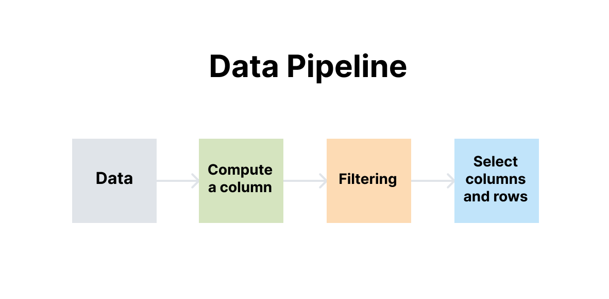

# Chapter 4. Pipeline and Tools

Data analysis is time-consuming because of many, many steps. To build a pipeline for it, R has a good module, [`tidyr`](https://tidyr.tidyverse.org/).  

In Julia, there's a package named [Tidier.jl](https://github.com/TidierOrg/Tidier.jl), doing the same thing.


```julia
import Pkg;
Pkg.add(["Tidier", "TidierStrings"]);
using Tidier, RDatasets, TidierStrings
```

       Resolving package versions...
      No Changes to `~/.julia/environments/v1.11/Project.toml`
      No Changes to `~/.julia/environments/v1.11/Manifest.toml`


## Load Data

Load a samle dataset, `iris`:


```julia
df = dataset("datasets", "iris")
first(df, 5)
```


<div><div style = "float: left;"><span>5×5 DataFrame</span></div><div style = "clear: both;"></div></div><div class = "data-frame" style = "overflow-x: scroll;"><table class = "data-frame" style = "margin-bottom: 6px;"><thead><tr class = "header"><th class = "rowNumber" style = "font-weight: bold; text-align: right;">Row</th><th style = "text-align: left;">SepalLength</th><th style = "text-align: left;">SepalWidth</th><th style = "text-align: left;">PetalLength</th><th style = "text-align: left;">PetalWidth</th><th style = "text-align: left;">Species</th></tr><tr class = "subheader headerLastRow"><th class = "rowNumber" style = "font-weight: bold; text-align: right;"></th><th title = "Float64" style = "text-align: left;">Float64</th><th title = "Float64" style = "text-align: left;">Float64</th><th title = "Float64" style = "text-align: left;">Float64</th><th title = "Float64" style = "text-align: left;">Float64</th><th title = "CategoricalValue{String, UInt8}" style = "text-align: left;">Cat…</th></tr></thead><tbody><tr><td class = "rowNumber" style = "font-weight: bold; text-align: right;">1</td><td style = "text-align: right;">5.1</td><td style = "text-align: right;">3.5</td><td style = "text-align: right;">1.4</td><td style = "text-align: right;">0.2</td><td style = "text-align: left;">setosa</td></tr><tr><td class = "rowNumber" style = "font-weight: bold; text-align: right;">2</td><td style = "text-align: right;">4.9</td><td style = "text-align: right;">3.0</td><td style = "text-align: right;">1.4</td><td style = "text-align: right;">0.2</td><td style = "text-align: left;">setosa</td></tr><tr><td class = "rowNumber" style = "font-weight: bold; text-align: right;">3</td><td style = "text-align: right;">4.7</td><td style = "text-align: right;">3.2</td><td style = "text-align: right;">1.3</td><td style = "text-align: right;">0.2</td><td style = "text-align: left;">setosa</td></tr><tr><td class = "rowNumber" style = "font-weight: bold; text-align: right;">4</td><td style = "text-align: right;">4.6</td><td style = "text-align: right;">3.1</td><td style = "text-align: right;">1.5</td><td style = "text-align: right;">0.2</td><td style = "text-align: left;">setosa</td></tr><tr><td class = "rowNumber" style = "font-weight: bold; text-align: right;">5</td><td style = "text-align: right;">5.0</td><td style = "text-align: right;">3.6</td><td style = "text-align: right;">1.4</td><td style = "text-align: right;">0.2</td><td style = "text-align: left;">setosa</td></tr></tbody></table></div>


## Data Pipeline

In the following pipeline, we wanna:
1. Create a new column dubbed `SepalLengthMax`, and fill the column with the maximum number of `SepalLength`;
2. Filter a subset of the rows in the dataframe whose `SepalWidth` is no less than 3.0
3. Select columns of SepalLength, SepalLengthMax, PetalLength
4. Only keep the first five rows for testing  
  



```julia
@chain df begin
    @mutate(SepalLengthMax = maximum(SepalLength))
    @filter(SepalWidth >= 3.0)
    @select(SepalLength, SepalLengthMax, PetalLength)
    @slice(1:5)
end
```


<div><div style = "float: left;"><span>5×3 DataFrame</span></div><div style = "clear: both;"></div></div><div class = "data-frame" style = "overflow-x: scroll;"><table class = "data-frame" style = "margin-bottom: 6px;"><thead><tr class = "header"><th class = "rowNumber" style = "font-weight: bold; text-align: right;">Row</th><th style = "text-align: left;">SepalLength</th><th style = "text-align: left;">SepalLengthMax</th><th style = "text-align: left;">PetalLength</th></tr><tr class = "subheader headerLastRow"><th class = "rowNumber" style = "font-weight: bold; text-align: right;"></th><th title = "Float64" style = "text-align: left;">Float64</th><th title = "Float64" style = "text-align: left;">Float64</th><th title = "Float64" style = "text-align: left;">Float64</th></tr></thead><tbody><tr><td class = "rowNumber" style = "font-weight: bold; text-align: right;">1</td><td style = "text-align: right;">5.1</td><td style = "text-align: right;">7.9</td><td style = "text-align: right;">1.4</td></tr><tr><td class = "rowNumber" style = "font-weight: bold; text-align: right;">2</td><td style = "text-align: right;">4.9</td><td style = "text-align: right;">7.9</td><td style = "text-align: right;">1.4</td></tr><tr><td class = "rowNumber" style = "font-weight: bold; text-align: right;">3</td><td style = "text-align: right;">4.7</td><td style = "text-align: right;">7.9</td><td style = "text-align: right;">1.3</td></tr><tr><td class = "rowNumber" style = "font-weight: bold; text-align: right;">4</td><td style = "text-align: right;">4.6</td><td style = "text-align: right;">7.9</td><td style = "text-align: right;">1.5</td></tr><tr><td class = "rowNumber" style = "font-weight: bold; text-align: right;">5</td><td style = "text-align: right;">5.0</td><td style = "text-align: right;">7.9</td><td style = "text-align: right;">1.4</td></tr></tbody></table></div>


Which is equivalent to the following codes in R:

    ```R
    library(dplyr)
    library(tidyr)

    df <- df %>%
    mutate(SepalLengthMax = max(SepalLength)) %>% # Create a new column with max value
    filter(SepalWidth >= 3.0) %>%                # Filter rows
    select(SepalLength, SepalLengthMax, PetalLength) %>% # Select specific columns
    slice(1:5)                                   # Take the first 5 rows
    ```

A full list of the Julia implementation of `tidyr` in R [can be found here](https://tidierorg.github.io/TidierData.jl/latest/).

## String Manipulation

In communication studies and many social sciences relevant to textual representations, we often handle large volumes of string data and may need to perform operations like detection and replacement on these strings.

We can use `TidierStrings.jl`:


```julia
first(df, 3)
```


<div><div style = "float: left;"><span>3×5 DataFrame</span></div><div style = "clear: both;"></div></div><div class = "data-frame" style = "overflow-x: scroll;"><table class = "data-frame" style = "margin-bottom: 6px;"><thead><tr class = "header"><th class = "rowNumber" style = "font-weight: bold; text-align: right;">Row</th><th style = "text-align: left;">SepalLength</th><th style = "text-align: left;">SepalWidth</th><th style = "text-align: left;">PetalLength</th><th style = "text-align: left;">PetalWidth</th><th style = "text-align: left;">Species</th></tr><tr class = "subheader headerLastRow"><th class = "rowNumber" style = "font-weight: bold; text-align: right;"></th><th title = "Float64" style = "text-align: left;">Float64</th><th title = "Float64" style = "text-align: left;">Float64</th><th title = "Float64" style = "text-align: left;">Float64</th><th title = "Float64" style = "text-align: left;">Float64</th><th title = "CategoricalValue{String, UInt8}" style = "text-align: left;">Cat…</th></tr></thead><tbody><tr><td class = "rowNumber" style = "font-weight: bold; text-align: right;">1</td><td style = "text-align: right;">5.1</td><td style = "text-align: right;">3.5</td><td style = "text-align: right;">1.4</td><td style = "text-align: right;">0.2</td><td style = "text-align: left;">setosa</td></tr><tr><td class = "rowNumber" style = "font-weight: bold; text-align: right;">2</td><td style = "text-align: right;">4.9</td><td style = "text-align: right;">3.0</td><td style = "text-align: right;">1.4</td><td style = "text-align: right;">0.2</td><td style = "text-align: left;">setosa</td></tr><tr><td class = "rowNumber" style = "font-weight: bold; text-align: right;">3</td><td style = "text-align: right;">4.7</td><td style = "text-align: right;">3.2</td><td style = "text-align: right;">1.3</td><td style = "text-align: right;">0.2</td><td style = "text-align: left;">setosa</td></tr></tbody></table></div>


**(1) Detection**

For example, we can filter rows with column names starting with `r'set.*'`


```julia
@chain df begin
    @mutate(Species = String(Species)) # convert categoreis into strings
    @filter(str_detect(Species, r"set.*")) # starting with set, using regex
    @slice(1:5) # head
end
```


<div><div style = "float: left;"><span>5×5 DataFrame</span></div><div style = "clear: both;"></div></div><div class = "data-frame" style = "overflow-x: scroll;"><table class = "data-frame" style = "margin-bottom: 6px;"><thead><tr class = "header"><th class = "rowNumber" style = "font-weight: bold; text-align: right;">Row</th><th style = "text-align: left;">SepalLength</th><th style = "text-align: left;">SepalWidth</th><th style = "text-align: left;">PetalLength</th><th style = "text-align: left;">PetalWidth</th><th style = "text-align: left;">Species</th></tr><tr class = "subheader headerLastRow"><th class = "rowNumber" style = "font-weight: bold; text-align: right;"></th><th title = "Float64" style = "text-align: left;">Float64</th><th title = "Float64" style = "text-align: left;">Float64</th><th title = "Float64" style = "text-align: left;">Float64</th><th title = "Float64" style = "text-align: left;">Float64</th><th title = "String" style = "text-align: left;">String</th></tr></thead><tbody><tr><td class = "rowNumber" style = "font-weight: bold; text-align: right;">1</td><td style = "text-align: right;">5.1</td><td style = "text-align: right;">3.5</td><td style = "text-align: right;">1.4</td><td style = "text-align: right;">0.2</td><td style = "text-align: left;">setosa</td></tr><tr><td class = "rowNumber" style = "font-weight: bold; text-align: right;">2</td><td style = "text-align: right;">4.9</td><td style = "text-align: right;">3.0</td><td style = "text-align: right;">1.4</td><td style = "text-align: right;">0.2</td><td style = "text-align: left;">setosa</td></tr><tr><td class = "rowNumber" style = "font-weight: bold; text-align: right;">3</td><td style = "text-align: right;">4.7</td><td style = "text-align: right;">3.2</td><td style = "text-align: right;">1.3</td><td style = "text-align: right;">0.2</td><td style = "text-align: left;">setosa</td></tr><tr><td class = "rowNumber" style = "font-weight: bold; text-align: right;">4</td><td style = "text-align: right;">4.6</td><td style = "text-align: right;">3.1</td><td style = "text-align: right;">1.5</td><td style = "text-align: right;">0.2</td><td style = "text-align: left;">setosa</td></tr><tr><td class = "rowNumber" style = "font-weight: bold; text-align: right;">5</td><td style = "text-align: right;">5.0</td><td style = "text-align: right;">3.6</td><td style = "text-align: right;">1.4</td><td style = "text-align: right;">0.2</td><td style = "text-align: left;">setosa</td></tr></tbody></table></div>


**(2) Replacing**


```julia
@chain df begin
    @mutate(Species = String(Species))
    @mutate(Species = str_replace(Species, "set", "setAAA"))
    @slice(1:5) # head
end
```


<div><div style = "float: left;"><span>5×5 DataFrame</span></div><div style = "clear: both;"></div></div><div class = "data-frame" style = "overflow-x: scroll;"><table class = "data-frame" style = "margin-bottom: 6px;"><thead><tr class = "header"><th class = "rowNumber" style = "font-weight: bold; text-align: right;">Row</th><th style = "text-align: left;">SepalLength</th><th style = "text-align: left;">SepalWidth</th><th style = "text-align: left;">PetalLength</th><th style = "text-align: left;">PetalWidth</th><th style = "text-align: left;">Species</th></tr><tr class = "subheader headerLastRow"><th class = "rowNumber" style = "font-weight: bold; text-align: right;"></th><th title = "Float64" style = "text-align: left;">Float64</th><th title = "Float64" style = "text-align: left;">Float64</th><th title = "Float64" style = "text-align: left;">Float64</th><th title = "Float64" style = "text-align: left;">Float64</th><th title = "String" style = "text-align: left;">String</th></tr></thead><tbody><tr><td class = "rowNumber" style = "font-weight: bold; text-align: right;">1</td><td style = "text-align: right;">5.1</td><td style = "text-align: right;">3.5</td><td style = "text-align: right;">1.4</td><td style = "text-align: right;">0.2</td><td style = "text-align: left;">setAAAosa</td></tr><tr><td class = "rowNumber" style = "font-weight: bold; text-align: right;">2</td><td style = "text-align: right;">4.9</td><td style = "text-align: right;">3.0</td><td style = "text-align: right;">1.4</td><td style = "text-align: right;">0.2</td><td style = "text-align: left;">setAAAosa</td></tr><tr><td class = "rowNumber" style = "font-weight: bold; text-align: right;">3</td><td style = "text-align: right;">4.7</td><td style = "text-align: right;">3.2</td><td style = "text-align: right;">1.3</td><td style = "text-align: right;">0.2</td><td style = "text-align: left;">setAAAosa</td></tr><tr><td class = "rowNumber" style = "font-weight: bold; text-align: right;">4</td><td style = "text-align: right;">4.6</td><td style = "text-align: right;">3.1</td><td style = "text-align: right;">1.5</td><td style = "text-align: right;">0.2</td><td style = "text-align: left;">setAAAosa</td></tr><tr><td class = "rowNumber" style = "font-weight: bold; text-align: right;">5</td><td style = "text-align: right;">5.0</td><td style = "text-align: right;">3.6</td><td style = "text-align: right;">1.4</td><td style = "text-align: right;">0.2</td><td style = "text-align: left;">setAAAosa</td></tr></tbody></table></div>


**(3) Equivalence test**


```julia
@chain df begin
    @mutate(Species = String(Species))
    @mutate(IsSetosa = str_equal(Species, "setosa"))
    @slice(1:5) # head
end
```


<div><div style = "float: left;"><span>5×6 DataFrame</span></div><div style = "clear: both;"></div></div><div class = "data-frame" style = "overflow-x: scroll;"><table class = "data-frame" style = "margin-bottom: 6px;"><thead><tr class = "header"><th class = "rowNumber" style = "font-weight: bold; text-align: right;">Row</th><th style = "text-align: left;">SepalLength</th><th style = "text-align: left;">SepalWidth</th><th style = "text-align: left;">PetalLength</th><th style = "text-align: left;">PetalWidth</th><th style = "text-align: left;">Species</th><th style = "text-align: left;">IsSetosa</th></tr><tr class = "subheader headerLastRow"><th class = "rowNumber" style = "font-weight: bold; text-align: right;"></th><th title = "Float64" style = "text-align: left;">Float64</th><th title = "Float64" style = "text-align: left;">Float64</th><th title = "Float64" style = "text-align: left;">Float64</th><th title = "Float64" style = "text-align: left;">Float64</th><th title = "String" style = "text-align: left;">String</th><th title = "Bool" style = "text-align: left;">Bool</th></tr></thead><tbody><tr><td class = "rowNumber" style = "font-weight: bold; text-align: right;">1</td><td style = "text-align: right;">5.1</td><td style = "text-align: right;">3.5</td><td style = "text-align: right;">1.4</td><td style = "text-align: right;">0.2</td><td style = "text-align: left;">setosa</td><td style = "text-align: right;">true</td></tr><tr><td class = "rowNumber" style = "font-weight: bold; text-align: right;">2</td><td style = "text-align: right;">4.9</td><td style = "text-align: right;">3.0</td><td style = "text-align: right;">1.4</td><td style = "text-align: right;">0.2</td><td style = "text-align: left;">setosa</td><td style = "text-align: right;">true</td></tr><tr><td class = "rowNumber" style = "font-weight: bold; text-align: right;">3</td><td style = "text-align: right;">4.7</td><td style = "text-align: right;">3.2</td><td style = "text-align: right;">1.3</td><td style = "text-align: right;">0.2</td><td style = "text-align: left;">setosa</td><td style = "text-align: right;">true</td></tr><tr><td class = "rowNumber" style = "font-weight: bold; text-align: right;">4</td><td style = "text-align: right;">4.6</td><td style = "text-align: right;">3.1</td><td style = "text-align: right;">1.5</td><td style = "text-align: right;">0.2</td><td style = "text-align: left;">setosa</td><td style = "text-align: right;">true</td></tr><tr><td class = "rowNumber" style = "font-weight: bold; text-align: right;">5</td><td style = "text-align: right;">5.0</td><td style = "text-align: right;">3.6</td><td style = "text-align: right;">1.4</td><td style = "text-align: right;">0.2</td><td style = "text-align: left;">setosa</td><td style = "text-align: right;">true</td></tr></tbody></table></div>


These three operations are frequently used in research but if you wanna more, please refer to [the documentation](https://github.com/TidierOrg/TidierStrings.jl).

**(4) Using symbolic vector in your pipeline**

In many cases, we need to use symbolic vectors to enhance the flexibility and expressiveness of our data processing pipelines. For example, we may have defined a symbloic vector `x` and we want to use it in the pipeline. In this case, we can use the `@mutate` macro to create a new column based on the symbolic vector `x`. The following example shows how to do this:

*4a. Incorrect version*


```julia
using Tidier, RDatasets, TidierStrings

df = dataset("datasets", "iris")
symbolic_vector = [:SepalLength, :SepalWidth, :PetalLength, :PetalWidth]
```


    4-element Vector{Symbol}:
     :SepalLength
     :SepalWidth
     :PetalLength
     :PetalWidth


# Incorrect version  
    ```Julia
    @chain df begin
        @select(symbolic_vector) # this will not work because the symbolic_vector will not be evaluated
        @head(3)
    end
    ```

*4b. Correct version*  


```julia
# Incorrect version
@chain df begin
    @select(!!symbolic_vector) # !! is used to tell Julia: hey bro this is a name of a variable
    @head(3)
end
```


<div><div style = "float: left;"><span>3×4 DataFrame</span></div><div style = "clear: both;"></div></div><div class = "data-frame" style = "overflow-x: scroll;"><table class = "data-frame" style = "margin-bottom: 6px;"><thead><tr class = "header"><th class = "rowNumber" style = "font-weight: bold; text-align: right;">Row</th><th style = "text-align: left;">SepalLength</th><th style = "text-align: left;">SepalWidth</th><th style = "text-align: left;">PetalLength</th><th style = "text-align: left;">PetalWidth</th></tr><tr class = "subheader headerLastRow"><th class = "rowNumber" style = "font-weight: bold; text-align: right;"></th><th title = "Float64" style = "text-align: left;">Float64</th><th title = "Float64" style = "text-align: left;">Float64</th><th title = "Float64" style = "text-align: left;">Float64</th><th title = "Float64" style = "text-align: left;">Float64</th></tr></thead><tbody><tr><td class = "rowNumber" style = "font-weight: bold; text-align: right;">1</td><td style = "text-align: right;">5.1</td><td style = "text-align: right;">3.5</td><td style = "text-align: right;">1.4</td><td style = "text-align: right;">0.2</td></tr><tr><td class = "rowNumber" style = "font-weight: bold; text-align: right;">2</td><td style = "text-align: right;">4.9</td><td style = "text-align: right;">3.0</td><td style = "text-align: right;">1.4</td><td style = "text-align: right;">0.2</td></tr><tr><td class = "rowNumber" style = "font-weight: bold; text-align: right;">3</td><td style = "text-align: right;">4.7</td><td style = "text-align: right;">3.2</td><td style = "text-align: right;">1.3</td><td style = "text-align: right;">0.2</td></tr></tbody></table></div>


## Network

How to retrieve APIs if we wanna download something? Similar to `requests` in Python, we can use `HTTP` and `JSON3` module in Julia.


```julia
import Pkg;
Pkg.add("JSON3");
using HTTP
using JSON3
```

       Resolving package versions...
      No Changes to `~/.julia/environments/v1.11/Project.toml`
      No Changes to `~/.julia/environments/v1.11/Manifest.toml`


For example, if we want to have a look at the structure of GitHub APIs:


```julia
url = "https://api.github.com"

req = HTTP.get(url)
req = JSON3.read(req.body)
req
```


    JSON3.Object{Vector{UInt8}, Vector{UInt64}} with 33 entries:
      :current_user_url                     => "https://api.github.com/user"
      :current_user_authorizations_html_url => "https://github.com/settings/connect…
      :authorizations_url                   => "https://api.github.com/authorizatio…
      :code_search_url                      => "https://api.github.com/search/code?…
      :commit_search_url                    => "https://api.github.com/search/commi…
      :emails_url                           => "https://api.github.com/user/emails"
      :emojis_url                           => "https://api.github.com/emojis"
      :events_url                           => "https://api.github.com/events"
      :feeds_url                            => "https://api.github.com/feeds"
      :followers_url                        => "https://api.github.com/user/followe…
      :following_url                        => "https://api.github.com/user/followi…
      :gists_url                            => "https://api.github.com/gists{/gist_…
      :hub_url                              => "https://api.github.com/hub"
      :issue_search_url                     => "https://api.github.com/search/issue…
      :issues_url                           => "https://api.github.com/issues"
      :keys_url                             => "https://api.github.com/user/keys"
      :label_search_url                     => "https://api.github.com/search/label…
      :notifications_url                    => "https://api.github.com/notification…
      :organization_url                     => "https://api.github.com/orgs/{org}"
      :organization_repositories_url        => "https://api.github.com/orgs/{org}/r…
      :organization_teams_url               => "https://api.github.com/orgs/{org}/t…
      :public_gists_url                     => "https://api.github.com/gists/public"
      :rate_limit_url                       => "https://api.github.com/rate_limit"
      :repository_url                       => "https://api.github.com/repos/{owner…
      :repository_search_url                => "https://api.github.com/search/repos…
      ⋮                                     => ⋮


Then, how can we run regression and many models? [Here's the guide](https://reynards-org.gitbook.io/data-analysis-in-julia/5.1.models.jl).
