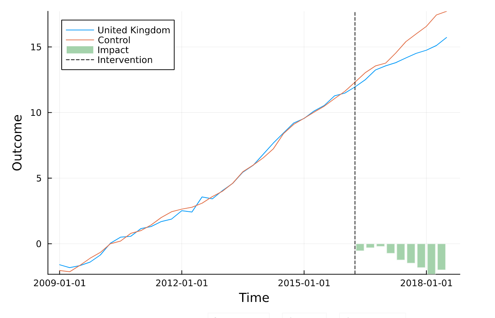

# Chatpter 5 (cont.). Advanced Causal Inference in Julia


```julia
import Pkg;
Pkg.add(["DiffinDiffs", "RegressionDiscontinuity", "SynthControl", "Dates", "Plots"]);
```

       Resolving package versions...
      No Changes to `~/.julia/environments/v1.11/Project.toml`
      No Changes to `~/.julia/environments/v1.11/Manifest.toml`


## Instrumental Variable


```julia
using DataFrames, RDatasets, FixedEffectModels
df = dataset("plm", "Cigar")
first(df, 5)
```


<div><div style = "float: left;"><span>5×9 DataFrame</span></div><div style = "clear: both;"></div></div><div class = "data-frame" style = "overflow-x: scroll;"><table class = "data-frame" style = "margin-bottom: 6px;"><thead><tr class = "header"><th class = "rowNumber" style = "font-weight: bold; text-align: right;">Row</th><th style = "text-align: left;">State</th><th style = "text-align: left;">Year</th><th style = "text-align: left;">Price</th><th style = "text-align: left;">Pop</th><th style = "text-align: left;">Pop16</th><th style = "text-align: left;">CPI</th><th style = "text-align: left;">NDI</th><th style = "text-align: left;">Sales</th><th style = "text-align: left;">Pimin</th></tr><tr class = "subheader headerLastRow"><th class = "rowNumber" style = "font-weight: bold; text-align: right;"></th><th title = "Int64" style = "text-align: left;">Int64</th><th title = "Int64" style = "text-align: left;">Int64</th><th title = "Float64" style = "text-align: left;">Float64</th><th title = "Float64" style = "text-align: left;">Float64</th><th title = "Float64" style = "text-align: left;">Float64</th><th title = "Float64" style = "text-align: left;">Float64</th><th title = "Float64" style = "text-align: left;">Float64</th><th title = "Float64" style = "text-align: left;">Float64</th><th title = "Float64" style = "text-align: left;">Float64</th></tr></thead><tbody><tr><td class = "rowNumber" style = "font-weight: bold; text-align: right;">1</td><td style = "text-align: right;">1</td><td style = "text-align: right;">63</td><td style = "text-align: right;">28.6</td><td style = "text-align: right;">3383.0</td><td style = "text-align: right;">2236.5</td><td style = "text-align: right;">30.6</td><td style = "text-align: right;">1558.3</td><td style = "text-align: right;">93.9</td><td style = "text-align: right;">26.1</td></tr><tr><td class = "rowNumber" style = "font-weight: bold; text-align: right;">2</td><td style = "text-align: right;">1</td><td style = "text-align: right;">64</td><td style = "text-align: right;">29.8</td><td style = "text-align: right;">3431.0</td><td style = "text-align: right;">2276.7</td><td style = "text-align: right;">31.0</td><td style = "text-align: right;">1684.07</td><td style = "text-align: right;">95.4</td><td style = "text-align: right;">27.5</td></tr><tr><td class = "rowNumber" style = "font-weight: bold; text-align: right;">3</td><td style = "text-align: right;">1</td><td style = "text-align: right;">65</td><td style = "text-align: right;">29.8</td><td style = "text-align: right;">3486.0</td><td style = "text-align: right;">2327.5</td><td style = "text-align: right;">31.5</td><td style = "text-align: right;">1809.84</td><td style = "text-align: right;">98.5</td><td style = "text-align: right;">28.9</td></tr><tr><td class = "rowNumber" style = "font-weight: bold; text-align: right;">4</td><td style = "text-align: right;">1</td><td style = "text-align: right;">66</td><td style = "text-align: right;">31.5</td><td style = "text-align: right;">3524.0</td><td style = "text-align: right;">2369.7</td><td style = "text-align: right;">32.4</td><td style = "text-align: right;">1915.16</td><td style = "text-align: right;">96.4</td><td style = "text-align: right;">29.5</td></tr><tr><td class = "rowNumber" style = "font-weight: bold; text-align: right;">5</td><td style = "text-align: right;">1</td><td style = "text-align: right;">67</td><td style = "text-align: right;">31.6</td><td style = "text-align: right;">3533.0</td><td style = "text-align: right;">2393.7</td><td style = "text-align: right;">33.4</td><td style = "text-align: right;">2023.55</td><td style = "text-align: right;">95.5</td><td style = "text-align: right;">29.6</td></tr></tbody></table></div>


For example, if we have an instrumental variable `Price` predicting `CPI` which predicts `Sales` (theoretically incorrect, just for illustration), the formula here should be:


```julia
#  DV ~ exogenous variables + (endogenous variables ~ instrumental variables) + fe(fixedeffect variable)
reg(df, @formula(Sales ~ NDI + (CPI ~ Price ) + fe(State)))
```


                               FixedEffectModel                           
    =======================================================================
    Number of obs:                1380   Converged:                    true
    dof (model):                     2   dof (residuals):              1333
    R²:                         -0.327   R² adjusted:                -0.373
    F-statistic:                42.695   P-value:                     0.000
    F-statistic (first stage): 39.4447   P-value (first stage):       0.000
    R² within:                  -3.259   Iterations:                      1
    =======================================================================
           Estimate  Std. Error    t-stat  Pr(>|t|)   Lower 95%   Upper 95%
    ───────────────────────────────────────────────────────────────────────
    NDI   0.0271309  0.00634835   4.2737     <1e-04   0.0146771   0.0395848
    CPI  -3.71621    0.817692    -4.54475    <1e-05  -5.32031    -2.1121
    =======================================================================


## Difference-in-difference


```julia
using DiffinDiffs
hrs = DiffinDiffsBase.exampledata("hrs")
```


    3280×11 VecColumnTable:
      Row │ hhidpn   wave  wave_hosp  oop_spend  riearnsemp  rwthh   male  spouse  ⋯
          │  Int64  Int64      Int64    Float64     Float64  Int64  Int64   Int64  ⋯
    ──────┼─────────────────────────────────────────────────────────────────────────
        1 │      1     10         10    6532.91   6.37159e5   4042      0       0  ⋯
        2 │      1      8         10    1326.93   3.67451e5   3975      0       0  ⋯
        3 │      1     11         10    1050.33     74130.5   3976      0       0  ⋯
        4 │      1      9         10    979.418     84757.4   3703      0       0  ⋯
        5 │      1      7         10    5498.68   1.66128e5   5295      0       0  ⋯
        6 │      2      8          8    41504.0         0.0   5187      0       1  ⋯
        7 │      2      7          8    3672.86         0.0   4186      0       1  ⋯
        8 │      2     10          8    1174.19         0.0   3729      0       1  ⋯
        9 │      2     11          8    6909.59         0.0   3906      0       1  ⋯
       10 │      2      9          8     1130.1         0.0   5453      0       1  ⋯
       11 │      3      9         10    2773.45     8475.74   4419      0       1  ⋯
      ⋮   │   ⋮       ⋮        ⋮          ⋮          ⋮         ⋮      ⋮      ⋮     ⋱
     3270 │    654     10         10    2876.32     45511.3   4372      0       0  ⋯
     3271 │    655      7          9    1910.74     25476.5   7682      0       1  ⋯
     3272 │    655     11          9    12402.5     34721.6   9203      0       1  ⋯
     3273 │    655      8          9     1530.0     45000.0   8461      0       1  ⋯
     3274 │    655      9          9    7373.89     10359.2   9345      0       1  ⋯
     3275 │    655     10          9    673.568     38229.5   8420      0       1  ⋯
     3276 │    656     11          8    3020.78         0.0   1930      0       0  ⋯
     3277 │    656      8          8     2632.0         0.0   4810      0       0  ⋯
     3278 │    656      9          8     657.34         0.0   4768      0       0  ⋯
     3279 │    656     10          8    782.795         0.0   1909      0       0  ⋯
     3280 │    656      7          8    4182.39         0.0   4374      0       0  ⋯


```julia
r = @did(Reg, data = hrs, dynamic(:wave, -1), notyettreated(11),
    vce = Vcov.cluster(:hhidpn), yterm = term(:oop_spend), treatname = :wave_hosp,
    treatintterms = (), xterms = (fe(:wave) + fe(:hhidpn)))
```


    ──────────────────────────────────────────────────────────────────────
    Summary of results: Regression-based DID
    ──────────────────────────────────────────────────────────────────────
    Number of obs:               2624    Degrees of freedom:            14
    F-statistic:                 6.42    p-value:                   <1e-07
    ──────────────────────────────────────────────────────────────────────
    Cohort-interacted sharp dynamic specification
    ──────────────────────────────────────────────────────────────────────
    Number of cohorts:              3    Interactions within cohorts:    0
    Relative time periods:          5    Excluded periods:              -1
    ──────────────────────────────────────────────────────────────────────
    Fixed effects: fe_hhidpn fe_wave
    ──────────────────────────────────────────────────────────────────────
    Converged:                   true    Singletons dropped:             0
    ──────────────────────────────────────────────────────────────────────


```julia
a = agg(r, :rel)
```


    ───────────────────────────────────────────────────────────────────
             Estimate  Std. Error     t  Pr(>|t|)  Lower 95%  Upper 95%
    ───────────────────────────────────────────────────────────────────
    rel: -3   591.046    1273.08   0.46    0.6425  -1905.3      3087.39
    rel: -2   352.639     697.78   0.51    0.6133  -1015.62     1720.9
    rel: 0   2960.04      540.989  5.47    <1e-07   1899.23     4020.86
    rel: 1    529.767     586.831  0.90    0.3667   -620.935    1680.47
    rel: 2    800.106    1010.81   0.79    0.4287  -1181.97     2782.18
    ───────────────────────────────────────────────────────────────────


## Regression Discontinuity


```julia
using RegressionDiscontinuity
data = RDData(RegressionDiscontinuity.Lee08())
```


    RDData{Vector{Float64}, RunningVariable{Float64, Float64, Vector{Float64}}}([0.0, 0.0, 0.0, 0.251144230365753, 0.23875193297862998, 0.267181247472763, 0.262862056493759, 0.0, 0.34071296453476, 0.6447104215621949  …  0.467111736536026, 0.712594926357269, 0.718958139419556, 0.791856050491333, 0.8541748523712159, 0.677568554878235, 0.808446884155273, 0.505452692508698, 1.0, 0.760513544082642], [-1.0, -1.0, -1.0, -1.0, -1.0, -1.0, -1.0, -1.0, -1.0, -1.0  …  1.0, 1.0, 1.0, 1.0, 1.0, 1.0, 1.0, 1.0, 1.0, 1.0])


```julia
fit(NaiveLocalLinearRD(kernel=Rectangular(), bandwidth=ImbensKalyanaraman()), data.ZsR, data.Ys)
```


    Local linear regression for regression discontinuity design
           ⋅⋅⋅⋅ Naive inference (not accounting for bias)
           ⋅⋅⋅⋅ Rectangular kernel (U[-0.5,0.5])
           ⋅⋅⋅⋅ Imbens Kalyanaraman bandwidth
           ⋅⋅⋅⋅ Eicker White Huber variance
    ────────────────────────────────────────────────────────────────────────────────────────────────
                              h        τ̂         se         bias     z   p-val  Lower 95%  Upper 95%
    ────────────────────────────────────────────────────────────────────────────────────────────────
    Sharp RD estimand  0.462024  0.08077  0.0087317  unaccounted  9.25  <1e-99  0.0636562  0.0978838
    ────────────────────────────────────────────────────────────────────────────────────────────────


## Synthetic Control


```julia
using SynthControl, Dates
df = load_brexit()
```


<div><div style = "float: left;"><span>897×3 DataFrame</span></div><div style = "float: right;"><span style = "font-style: italic;">872 rows omitted</span></div><div style = "clear: both;"></div></div><div class = "data-frame" style = "overflow-x: scroll;"><table class = "data-frame" style = "margin-bottom: 6px;"><thead><tr class = "header"><th class = "rowNumber" style = "font-weight: bold; text-align: right;">Row</th><th style = "text-align: left;">country</th><th style = "text-align: left;">quarter</th><th style = "text-align: left;">realgdp</th></tr><tr class = "subheader headerLastRow"><th class = "rowNumber" style = "font-weight: bold; text-align: right;"></th><th title = "String" style = "text-align: left;">String</th><th title = "Date" style = "text-align: left;">Date</th><th title = "Float64" style = "text-align: left;">Float64</th></tr></thead><tbody><tr><td class = "rowNumber" style = "font-weight: bold; text-align: right;">1</td><td style = "text-align: left;">Australia</td><td style = "text-align: left;">2009-01-01</td><td style = "text-align: right;">1.04</td></tr><tr><td class = "rowNumber" style = "font-weight: bold; text-align: right;">2</td><td style = "text-align: left;">Austria</td><td style = "text-align: left;">2009-01-01</td><td style = "text-align: right;">-1.53</td></tr><tr><td class = "rowNumber" style = "font-weight: bold; text-align: right;">3</td><td style = "text-align: left;">Belgium</td><td style = "text-align: left;">2009-01-01</td><td style = "text-align: right;">-1.15</td></tr><tr><td class = "rowNumber" style = "font-weight: bold; text-align: right;">4</td><td style = "text-align: left;">Canada</td><td style = "text-align: left;">2009-01-01</td><td style = "text-align: right;">-2.28</td></tr><tr><td class = "rowNumber" style = "font-weight: bold; text-align: right;">5</td><td style = "text-align: left;">Denmark</td><td style = "text-align: left;">2009-01-01</td><td style = "text-align: right;">-1.42</td></tr><tr><td class = "rowNumber" style = "font-weight: bold; text-align: right;">6</td><td style = "text-align: left;">Finland</td><td style = "text-align: left;">2009-01-01</td><td style = "text-align: right;">-6.8</td></tr><tr><td class = "rowNumber" style = "font-weight: bold; text-align: right;">7</td><td style = "text-align: left;">France</td><td style = "text-align: left;">2009-01-01</td><td style = "text-align: right;">-1.67</td></tr><tr><td class = "rowNumber" style = "font-weight: bold; text-align: right;">8</td><td style = "text-align: left;">Germany</td><td style = "text-align: left;">2009-01-01</td><td style = "text-align: right;">-4.49</td></tr><tr><td class = "rowNumber" style = "font-weight: bold; text-align: right;">9</td><td style = "text-align: left;">Greece</td><td style = "text-align: left;">2009-01-01</td><td style = "text-align: right;">-4.74</td></tr><tr><td class = "rowNumber" style = "font-weight: bold; text-align: right;">10</td><td style = "text-align: left;">Iceland</td><td style = "text-align: left;">2009-01-01</td><td style = "text-align: right;">-7.61</td></tr><tr><td class = "rowNumber" style = "font-weight: bold; text-align: right;">11</td><td style = "text-align: left;">Ireland</td><td style = "text-align: left;">2009-01-01</td><td style = "text-align: right;">-0.34</td></tr><tr><td class = "rowNumber" style = "font-weight: bold; text-align: right;">12</td><td style = "text-align: left;">Italy</td><td style = "text-align: left;">2009-01-01</td><td style = "text-align: right;">-2.75</td></tr><tr><td class = "rowNumber" style = "font-weight: bold; text-align: right;">13</td><td style = "text-align: left;">Japan</td><td style = "text-align: left;">2009-01-01</td><td style = "text-align: right;">-4.88</td></tr><tr><td style = "text-align: right;">&vellip;</td><td style = "text-align: right;">&vellip;</td><td style = "text-align: right;">&vellip;</td><td style = "text-align: right;">&vellip;</td></tr><tr><td class = "rowNumber" style = "font-weight: bold; text-align: right;">886</td><td style = "text-align: left;">Italy</td><td style = "text-align: left;">2018-07-01</td><td style = "text-align: right;">-0.82</td></tr><tr><td class = "rowNumber" style = "font-weight: bold; text-align: right;">887</td><td style = "text-align: left;">Japan</td><td style = "text-align: left;">2018-07-01</td><td style = "text-align: right;">9.54</td></tr><tr><td class = "rowNumber" style = "font-weight: bold; text-align: right;">888</td><td style = "text-align: left;">Luxembourg</td><td style = "text-align: left;">2018-07-01</td><td style = "text-align: right;">28.41</td></tr><tr><td class = "rowNumber" style = "font-weight: bold; text-align: right;">889</td><td style = "text-align: left;">Netherlands</td><td style = "text-align: left;">2018-07-01</td><td style = "text-align: right;">10.69</td></tr><tr><td class = "rowNumber" style = "font-weight: bold; text-align: right;">890</td><td style = "text-align: left;">New Zealand</td><td style = "text-align: left;">2018-07-01</td><td style = "text-align: right;">24.06</td></tr><tr><td class = "rowNumber" style = "font-weight: bold; text-align: right;">891</td><td style = "text-align: left;">Norway</td><td style = "text-align: left;">2018-07-01</td><td style = "text-align: right;">12.82</td></tr><tr><td class = "rowNumber" style = "font-weight: bold; text-align: right;">892</td><td style = "text-align: left;">Portugal</td><td style = "text-align: left;">2018-07-01</td><td style = "text-align: right;">2.23</td></tr><tr><td class = "rowNumber" style = "font-weight: bold; text-align: right;">893</td><td style = "text-align: left;">Spain</td><td style = "text-align: left;">2018-07-01</td><td style = "text-align: right;">5.74</td></tr><tr><td class = "rowNumber" style = "font-weight: bold; text-align: right;">894</td><td style = "text-align: left;">Sweden</td><td style = "text-align: left;">2018-07-01</td><td style = "text-align: right;">22.48</td></tr><tr><td class = "rowNumber" style = "font-weight: bold; text-align: right;">895</td><td style = "text-align: left;">Switzerland</td><td style = "text-align: left;">2018-07-01</td><td style = "text-align: right;">14.35</td></tr><tr><td class = "rowNumber" style = "font-weight: bold; text-align: right;">896</td><td style = "text-align: left;">United Kingdom</td><td style = "text-align: left;">2018-07-01</td><td style = "text-align: right;">15.72</td></tr><tr><td class = "rowNumber" style = "font-weight: bold; text-align: right;">897</td><td style = "text-align: left;">United States</td><td style = "text-align: left;">2018-07-01</td><td style = "text-align: right;">19.32</td></tr></tbody></table></div>


```julia
bp = BalancedPanel(df, "United Kingdom" => Date(2016, 7, 1); id_var = :country, t_var = :quarter, outcome_var = :realgdp)
```

    Balanced Panel - single treated unit, continuous treatment


    


        Treated unit: United Kingdom
        Number of untreated units: 22
        First treatment period: 2016-07-01
        Number of pretreatment periods: 30
        Number of treatment periods: 9


```julia
s = SimpleSCM(bp)
```


    


    Synthetic Control Model
    
    Treatment panel:
    
    Model is not fitted


    Balanced Panel - single treated unit, continuous treatment
        Treated unit: United Kingdom
        Number of untreated units: 22
        First treatment period: 2016-07-01
        Number of pretreatment periods: 30
        Number of treatment periods: 9


```julia
fit!(s)
```


    


    Synthetic Control Model
    
    Treatment panel:
    	Model is fitted
    	Impact estimates: [-0.54, -0.31, -0.206, -0.732, -1.241, -1.482, -1.818, -2.327, -1.994]


    Balanced Panel - single treated unit, continuous treatment
        Treated unit: United Kingdom
        Number of untreated units: 22
        First treatment period: 2016-07-01
        Number of pretreatment periods: 30
        Number of treatment periods: 9


```julia
using Plots
plot(s)
```



## SyntheticDiD


```julia
sp = load_smoking_panel()
```


    


    Balanced Panel - single treated unit, continuous treatment
        Treated unit: 3
        Number of untreated units: 38
        First treatment period: 1989
        Number of pretreatment periods: 19
        Number of treatment periods: 12


```julia
sdid_model = SyntheticDiD(sp)
```


    Synthetic Difference-in-Differences Model
    
    Model is not fitted


```julia
fit!(sdid_model)
```


    Synthetic Difference-in-Differences Model
    	Model is fitted
    	Impact estimate: -15.604


