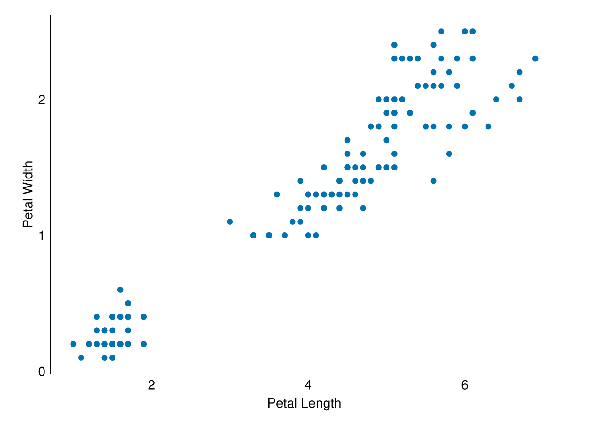
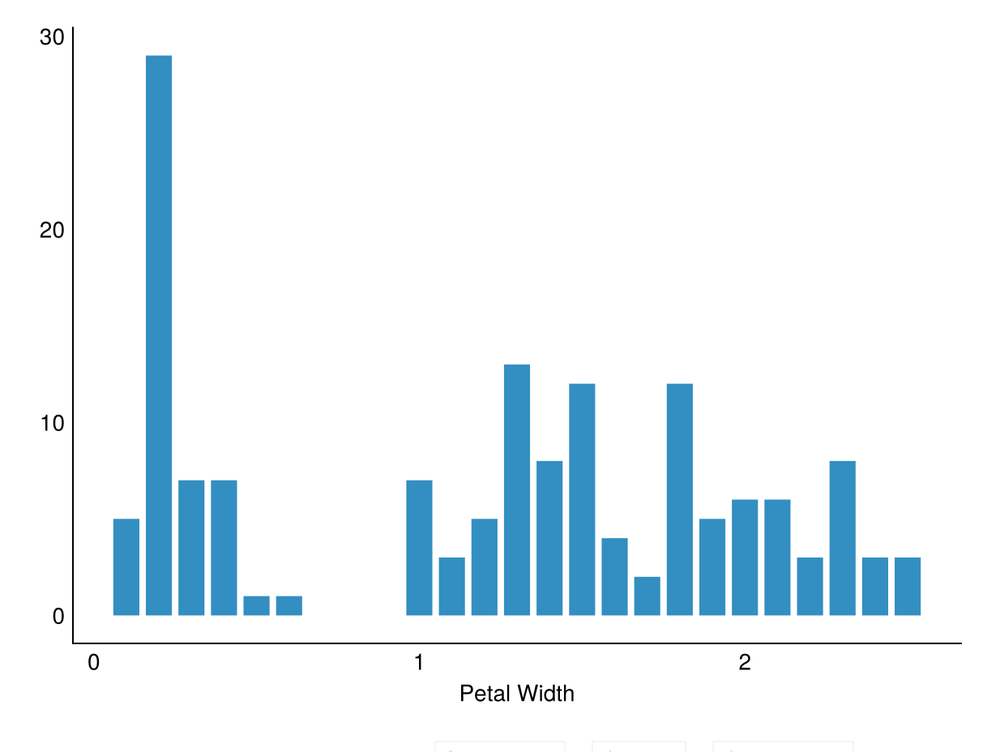
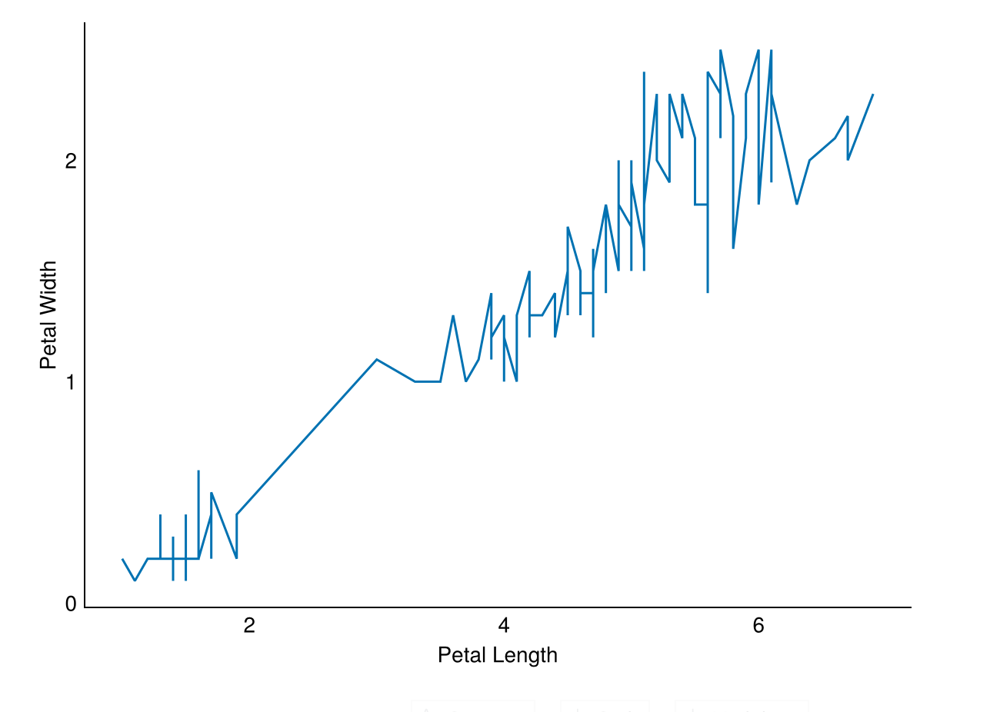
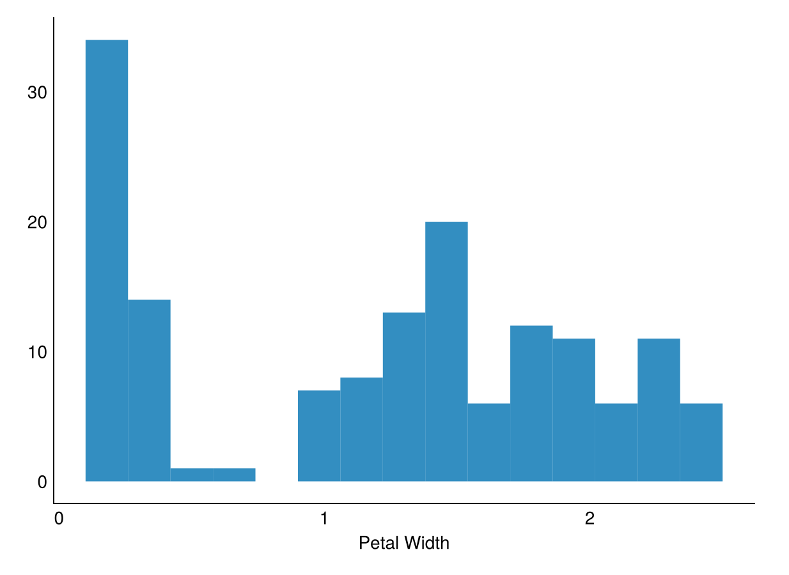
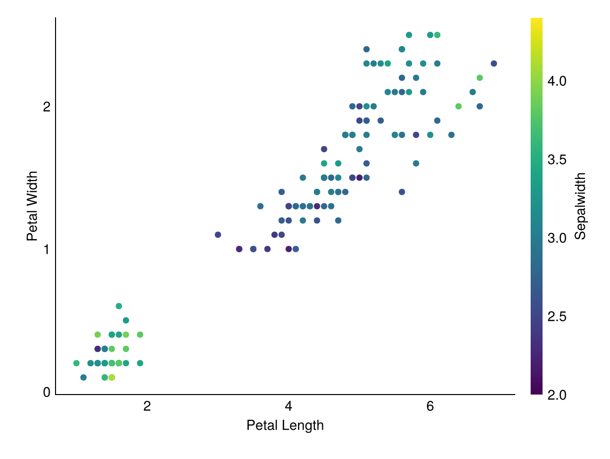
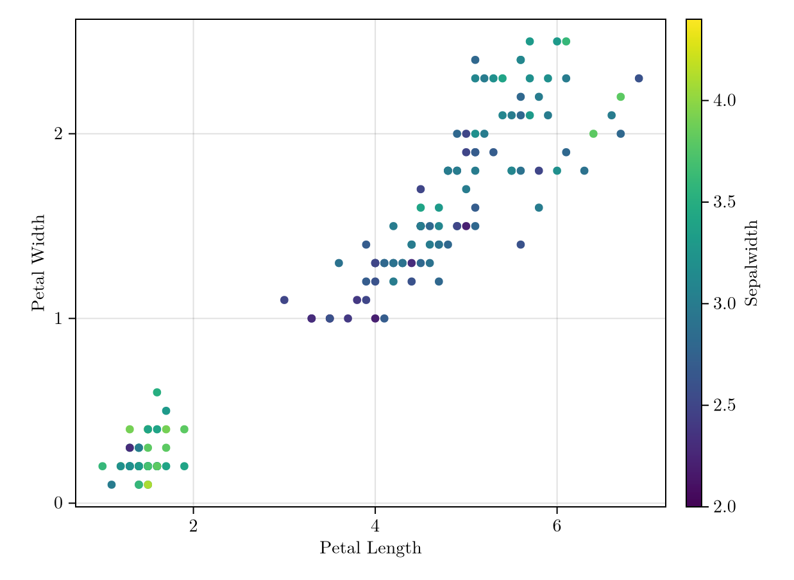
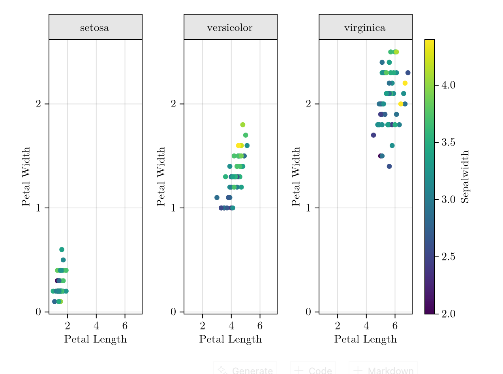

# Chapter 6. Data Visualization in Julia


```julia
import Pkg;
Pkg.add(["Tidier", "TidierData", "TidierText", "TidierStrings", "TidierPlots", "DataFrames", "CSV", "Pipelines", "Makie", "StatsPlots", "RDatasets"]);
using Tidier, TidierData, TidierText, TidierStrings, TidierPlots, DataFrames, CSV, Pipelines, Makie, StatsPlots, RDatasets
import Makie.IntervalsBetween, Makie.Attributes

TidierPlots_set("plot_log", false) # I don't not want to see many logs
TidierPlots_set("plot_show", false) # and repetitive plots in VSCode
```

       Resolving package versions...
      No Changes to `~/.julia/environments/v1.11/Project.toml`
      No Changes to `~/.julia/environments/v1.11/Manifest.toml`


    false


## Load Data


```julia
df = dataset("datasets", "iris")
first(df, 5)
```


<div><div style = "float: left;"><span>5×5 DataFrame</span></div><div style = "clear: both;"></div></div><div class = "data-frame" style = "overflow-x: scroll;"><table class = "data-frame" style = "margin-bottom: 6px;"><thead><tr class = "header"><th class = "rowNumber" style = "font-weight: bold; text-align: right;">Row</th><th style = "text-align: left;">SepalLength</th><th style = "text-align: left;">SepalWidth</th><th style = "text-align: left;">PetalLength</th><th style = "text-align: left;">PetalWidth</th><th style = "text-align: left;">Species</th></tr><tr class = "subheader headerLastRow"><th class = "rowNumber" style = "font-weight: bold; text-align: right;"></th><th title = "Float64" style = "text-align: left;">Float64</th><th title = "Float64" style = "text-align: left;">Float64</th><th title = "Float64" style = "text-align: left;">Float64</th><th title = "Float64" style = "text-align: left;">Float64</th><th title = "CategoricalValue{String, UInt8}" style = "text-align: left;">Cat…</th></tr></thead><tbody><tr><td class = "rowNumber" style = "font-weight: bold; text-align: right;">1</td><td style = "text-align: right;">5.1</td><td style = "text-align: right;">3.5</td><td style = "text-align: right;">1.4</td><td style = "text-align: right;">0.2</td><td style = "text-align: left;">setosa</td></tr><tr><td class = "rowNumber" style = "font-weight: bold; text-align: right;">2</td><td style = "text-align: right;">4.9</td><td style = "text-align: right;">3.0</td><td style = "text-align: right;">1.4</td><td style = "text-align: right;">0.2</td><td style = "text-align: left;">setosa</td></tr><tr><td class = "rowNumber" style = "font-weight: bold; text-align: right;">3</td><td style = "text-align: right;">4.7</td><td style = "text-align: right;">3.2</td><td style = "text-align: right;">1.3</td><td style = "text-align: right;">0.2</td><td style = "text-align: left;">setosa</td></tr><tr><td class = "rowNumber" style = "font-weight: bold; text-align: right;">4</td><td style = "text-align: right;">4.6</td><td style = "text-align: right;">3.1</td><td style = "text-align: right;">1.5</td><td style = "text-align: right;">0.2</td><td style = "text-align: left;">setosa</td></tr><tr><td class = "rowNumber" style = "font-weight: bold; text-align: right;">5</td><td style = "text-align: right;">5.0</td><td style = "text-align: right;">3.6</td><td style = "text-align: right;">1.4</td><td style = "text-align: right;">0.2</td><td style = "text-align: left;">setosa</td></tr></tbody></table></div>


## Basic Plots

### 1. Scatter Plot


```julia
ggplot(data=df) +
geom_point(@aes(x = PetalLength, y = PetalWidth)) +
labs(x="Petal Length", y="Petal Width") +
theme_minimal()
```



### 2. Bar Plot


```julia
ggplot(data=df) +
geom_bar(@aes(x = PetalWidth)) +
labs(x="Petal Width") +
theme_minimal()
```



### 3. Line Plot


```julia
ggplot(data=df, @aes(x = PetalLength, y = PetalWidth)) +
geom_line() +
labs(x="Petal Length", y="Petal Width") +
theme_minimal()

```



### 4. Histogram


```julia
ggplot(data=df, @aes(x = PetalWidth)) +
geom_histogram() +
labs(x="Petal Width") +
theme_minimal()

```



## Color and themes

### 1. Color


```julia
ggplot(data=df, @aes(x = PetalLength, y = PetalWidth, color = SepalWidth)) +
geom_point() +
labs(x="Petal Length", y="Petal Width") +
theme_minimal()
```



### 2. Themes


```julia
ggplot(data=df, @aes(x = PetalLength, y = PetalWidth, color = SepalWidth)) +
geom_point() +
labs(x="Petal Length", y="Petal Width") +
theme_latexfonts()
```



## Facet


```julia
ggplot(data=df, @aes(x = PetalLength, y = PetalWidth, color = SepalWidth)) +
geom_point() +
facet_wrap("Species") +
labs(x="Petal Length", y="Petal Width") +
theme_latexfonts()
```



However, the supports of ggplot-like visualization cannot be identical to that of `ggplot2` in `R`.

If you want to use R packages or Python packages for certain purposes, we can also simply [use them in Julia](./7.r.and.python.in.julia.jl.ipynb)
