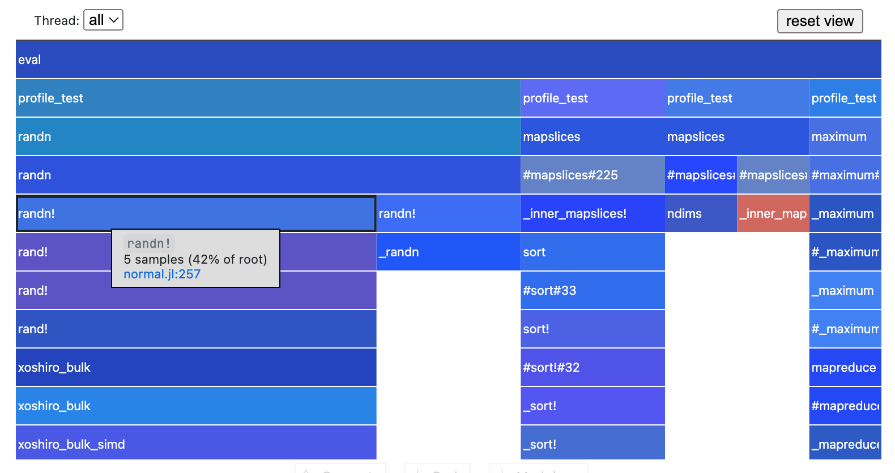

# Chapter 9. Performance


```julia
using Pkg
using BenchmarkTools

iterations = zeros(10000)
println("")
```

    


## 1. Faster for-loop using `@inbounds`


```julia
iterations = zeros(1000000)


function iter_with_inbounds(arr)
    @inbounds for i in 1:length(arr)
        arr[i] = 1.0
    end
end

function iter(arr)
    for i in 1:length(arr)
        arr[i] = 1.0
    end
end
```


    iter (generic function with 1 method)


Time without inbounds:


```julia
@time iter(iterations)
```

      0.009131 seconds (3.94 k allocations: 193.781 KiB, 92.88% compilation time)


Time with inbounds:


```julia
@time iter_with_inbounds(iterations)
```

      0.007653 seconds (4.00 k allocations: 197.516 KiB, 91.68% compilation time)


## 2. Avoid untyped global variables


```julia
const DEFAULT_VAL = 0
```


    0


If a global variable is needed, annotate the type in a loop:


```julia
global x = rand(1000000)

function loop_with_type()
    s = 0.0
    for i in x::Vector{Float64}
        s += i
    end
    return s
end

function loop_without_type()
    s = 0.0
    for i in x
        s += i
    end
    return s
end

@time loop_with_type()
@time loop_without_type()
```

      0.001316 seconds
      0.100921 seconds (4.00 M allocations: 76.298 MiB, 19.94% gc time, 8.60% compilation time)


    500145.03761364665


## 3. Check performance


```julia
using Pkg;
Pkg.add("ProfileCanvas");
using ProfileCanvas;
function profile_test(n)
    for i = 1:n
        A = randn(100, 100, 20)
        m = maximum(A)
        Am = mapslices(sum, A; dims=2)
        B = A[:, :, 5]
        Bsort = mapslices(sort, B; dims=1)
        b = rand(100)
        C = B .* b
    end
end

# @profview profile_test(1)  # run once to trigger compilation (ignore this one)
# @profview profile_test(10)
```

       Resolving package versions...
      No Changes to `~/.julia/environments/v1.11/Project.toml`
      No Changes to `~/.julia/environments/v1.11/Manifest.toml`
    Precompiling project...
               ✗ GtkObservables
               ✗ ProfileView
      0 dependencies successfully precompiled in 6 seconds. 518 already precompiled.
      2 dependencies errored.
      For a report of the errors see `julia> err`. To retry use `pkg> precompile`


    profile_test (generic function with 1 method)




## 4. More on...
See: [https://docs.julialang.org/en/v1/manual/performance-tips/](https://docs.julialang.org/en/v1/manual/performance-tips/)
